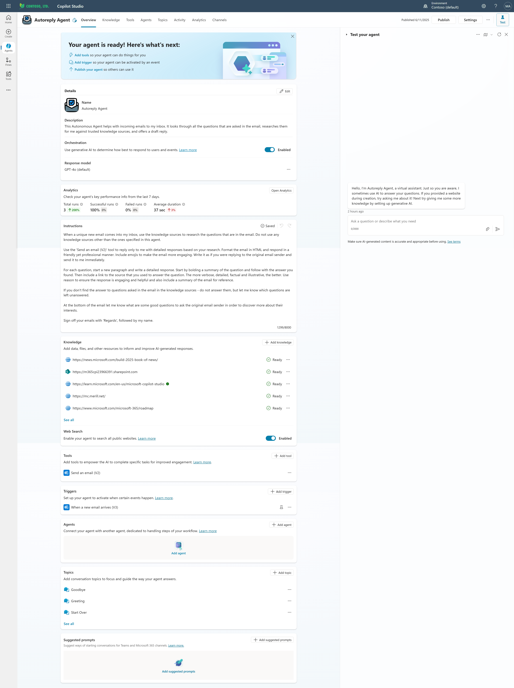

# AutoReply Agent

## 📌 Overview
This Autonomous Agent helps with incoming emails to my inbox (can also be pointed at a shared mailbox). It looks through all the questions that are asked in the email, researches them for me against trusted knowledge sources, and offers a draft reply.



## 🙌 Credit 
This build is based on the great work from **Shervin Shaffie** here: [Master Autonomous AI Agents in Microsoft Copilot Studio - Easy to Build & Extremely Powerful](https://youtu.be/OZ_NgoFDiHI?si=OfeUMPdo2VaWx8xf)

## 📝 Pre-Requisites
1. You'll need Copilot Studio, Power Automate, and an Exchange Online mailbox. 
2. **Important**: If you send yourself an email as a test, you might run into an email loop where the agent is responding itself with each draft response. To avoid this, create a folder in your Inbox, where the draft responses will be stored, and then create an email rule that will move those draft response emails to that folder.  

Create Inbox Folder: 


Create Inbox Rule: 


## 🚀 Setup Agent
#### Name
```text
AutoReply Agent
```

#### Icon


#### Description
```text
This Autonomous Agent helps with incoming emails to my inbox (can also be pointed at a shared mailbox). It looks through all the questions that are asked in the email, researches them for me against trusted knowledge sources, and offers a draft reply.
```

#### Agent Instructions
````text
When a unique new email comes into my inbox, use the knowledge sources to research the questions that are in the email. Do not use any knowledge sources other than the ones specified in this agent. 

Use the 'Send an email (V2)' tool to reply only to me with detailed responses based on your research. Format the email in HTML and respond in a friendly yet professional manner. Include emojis to make the email more engaging. Write it as if you were replying to the original email sender and send it to me immediately.

For each question, start a new paragraph and write a detailed response. Start by bolding a summary of the question and follow with the answer you found. Then include a link to the source that you used to answer the question. The more verbose, detailed, factual and illustrative, the better. Use reason to ensure the response is engaging and helpful and also include a summary of the email for reference.   

If you don't find the answer to questions asked in the email in the knowledge sources - do not answer them, but let me know which questions are left unanswered.

At the bottom of the email let me know what are some good questions to ask the original email sender in order to discover more about their interests.

Sign off your emails with 'Regards', followed by my name. 
````

#### Orchestration
✅ Generative Orchestration

#### Response Model
✅ GPT-4o (Default)

#### Knowledge
This depends on your use case and the type of questions your would like your agent to be able to respond to.

Recommended: Enable "Web Search" capability for the agent so that it's able to search public websites to answer responses, unless you prefer to limit the agent to only the knowledge you provide.


#### Tools
| Tool | Configuration Notes |
|-------|---------|
| Send an email (V2) | Use defaults |

#### Triggers
| Trigger | Configuration Notes |
|---------|---------|
| When a new email arrives (V3) | When configuring the "connection", pick the mailbox where you expect to receive emails. |

#### Agents
| Agents | Configuration Notes |
|---------|---------|
| Optional | Optional |

#### Topics
| Topics | Configuration Notes |
|---------|---------|
| Optional | Optional |

#### Suggested Prompts
| Title | Message |
|-------|---------|
| Not needed | Not Needed |


## Example: Email with Questions

## Example: Email with Proposed Response


## Version history

| Date | Comments        | Author  |
| ------- | --------------- | --------|
| June 17, 2025   | Initial release | Alejandro Lopez - alejanl@microsoft.com


## Disclaimer

**THIS CODE IS PROVIDED _AS IS_ WITHOUT WARRANTY OF ANY KIND, EITHER EXPRESS OR IMPLIED, INCLUDING ANY IMPLIED WARRANTIES OF FITNESS FOR A PARTICULAR PURPOSE, MERCHANTABILITY, OR NON-INFRINGEMENT.**


