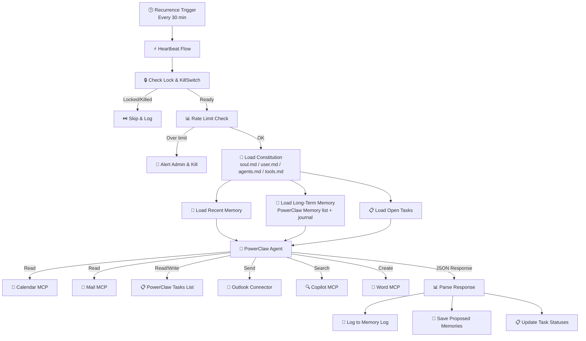

[← Back to README](./README.md)

# PowerClaw: Architecture & Use Cases

**PowerClaw** is an **autonomous AI chief of staff** for Microsoft 365. It runs on a 30-minute heartbeat via Power Automate, proactively monitoring calendar, email, and tasks. It uses a SharePoint site as its "brain" with constitution files, memory lists, and a task board.

---

## 1. How the Heartbeat Works

The core of PowerClaw is a recursive heartbeat that fires every 30 minutes. It is designed to be resilient, context-aware, and safe.

### The Cycle
1.  **Trigger**: Power Automate fires on a schedule.
2.  **Safety Check**: Verifies `KillSwitch` is `false` and checks the concurrency lock (`IsRunning`) to prevent overlapping runs.
3.  **Context Loading (Parallel)**:
    *   **Constitution**: Loads `soul.md`, `user.md`, `agents.md`, and `tools.md` from SharePoint.
    *   **Memory Log**: Retrieves the last 25 actions for immediate context.
    *   **Long-Term Memory**: Fetches top 15 active facts based on importance and confidence.
    *   **Tasks**: Loads open items from the "PowerClaw Tasks" list.
4.  **Agent Invocation**: The full context is sent to the Copilot Studio agent.
5.  **Execution**: The agent uses MCP tools to read calendar, check email, search via Copilot, or create documents.
6.  **Response Processing**: The agent returns structured JSON containing thoughts, actions taken, memory updates, and task changes.
7.  **Persist State**: The flow logs the activity, saves new memories, and updates task statuses.
8.  **Housekeeping**: Once a day, the system prunes old logs and expires outdated memories.

## 2. Execution Priority Order

The agent processes work in a strict hierarchy during each heartbeat to ensure critical duties are never missed.

1.  **Priority 1: Calendar Routines**
    *   Checks for active calendar events specifically flagged for PowerClaw (e.g., "Research X", "Morning Briefing").
    *   **Must complete fully**, including sending a deliverable email.
2.  **Priority 2: Proactive Intelligence**
    *   Scans for urgent unread emails or upcoming meetings (within 30 min).
    *   Looks for trending content relevant to the user.
    *   *Limit: Max 1 alert email per heartbeat.*
3.  **Priority 3: Task Management**
    *   Picks up to **2 tasks** from the SharePoint Tasks list where status is "To Do".
    *   Executes the work, emails the result, and moves the task to "Human Review".
4.  **Priority 4: Observations**
    *   Updates long-term memory with new patterns, preferences, or insights about the user's work.

## 3. The Constitution System

PowerClaw's personality and operating rules are fully decoupled from code. You can modify its behavior by editing four markdown files in SharePoint:

*   **`soul.md`**: The core identity. Defines values, communication style, and ethical guardrails.
*   **`user.md`**: Context about you. Your name, role, team structure, preferences, and current focus areas.
*   **`agents.md`**: Operational rules. Defines when to check the calendar, how to triage email, digest schedules, and quiet hours.
*   **`tools.md`**: A reference manual for the agent on available MCP tools and connectors.

> 💡 **Tip:** Changing `agents.md` is the safest way to tweak daily behavior without risking the core logic in `soul.md`.

## 4. Memory System

PowerClaw utilizes a three-tier memory architecture to maintain continuity over time.

1.  **Memory Log (Short-Term)**
    *   **Storage:** SharePoint List
    *   **Function:** An audit trail of every action taken in the last heartbeat.
    *   **Capacity:** Last 25 entries loaded per cycle; auto-pruned after 30 days.
2.  **PowerClaw Memory (Semantic)**
    *   **Storage:** SharePoint List
    *   **Function:** specific facts about preferences, people, projects, and commitments.
    *   **Metadata:** Includes confidence scores, importance levels, and expiration dates.
    *   **Capacity:** Top 15 active items loaded per cycle.
3.  **Memory Journal (Episodic)**
    *   **Storage:** `memory-journal.md` (SharePoint file)
    *   **Function:** A rolling narrative of observations. Episodic memories are eventually consolidated into semantic facts.
    *   **Capacity:** Auto-truncated to keep relevant context manageable.

## 5. Task Management (Kanban)

The agent interacts with a SharePoint list designed as a Kanban board:

| Status | Owner | Description |
| :--- | :--- | :--- |
| **📋 To Do** | PowerClaw | Agent picks up tasks here. Sends a "Starting" email with its initial analysis. |
| **👁️ Human Review** | User | Work is done. User reviews the emailed deliverable. |
| **✅ Done** | System | Task complete. |

Tasks can be created via:
*   Direct entry in SharePoint.
*   Calendar events (PowerClaw recognizes task-oriented blocks).
*   Interactive chat ("create a task for...").

## 6. Email Template

PowerClaw communicates via distinct, dark-themed professional emails designed for quick scanning:

*   **Background**: Dark Grey (`#1a1a1a`)
*   **Cards**: Lighter Grey (`#252525`) with Blue (`#0078D4`) accent borders.
*   **Typography**: Segoe UI with Cyan headings (`#00BCF2`).
*   **Badges**: Blue tags for status updates.

## 7. Use Cases

### 📅 Morning Briefing
Start your day with an automated summary of today's calendar, pending tasks, important emails, and trending documents.

<!-- Screenshot: morning-briefing-email.png -->
📸 *Screenshot: Morning Briefing Email — coming soon*

### 📋 Research Task Execution
Add "Research competitor pricing for Q2 review" to your Tasks list. PowerClaw picks it up, researches using the Copilot MCP, creates a Word document, and emails you the deliverable.

<!-- Screenshot: task-lifecycle.gif -->
📸 *Screenshot: Task Lifecycle Animation — coming soon*

### 🔔 Calendar-Driven Work
Create a calendar event: "Prepare team meeting agenda for 2pm standup". PowerClaw executes during that time window, checks attendees, reviews recent emails from them, and sends you a prepared agenda.

<!-- Screenshot: calendar-task.png -->
📸 *Screenshot: Calendar-Driven Task Execution — coming soon*

### ⚡ Proactive Alerts
PowerClaw detects an urgent email from your VP or notices you have a meeting in 15 minutes with no prep done — sends you a heads-up with context.

<!-- Screenshot: proactive-alert.png -->
📸 *Screenshot: Proactive Alert Email — coming soon*

### 📊 Daily Digest
End-of-day summary: what PowerClaw did today, tasks completed, meetings attended, patterns noticed.

<!-- Screenshot: daily-digest.png -->
📸 *Screenshot: Daily Digest Summary — coming soon*

## 8. Configuration Reference

Quick reference for the **Settings** list in SharePoint:

| Setting | Default | Purpose |
| :--- | :--- | :--- |
| **KillSwitch** | `false` | Emergency stop for all autonomous activity. |
| **IsRunning** | `false` | Concurrency lock (auto-managed by flow). |
| **MaxActionsPerHour** | `20` | Rate limit safety valve. |
| **HeartbeatIntervalMinutes** | `30` | Frequency of the flow trigger. |
| **MemoryMaxActiveItems** | `100` | Cap on active long-term memories loaded. |
| **LastHousekeepingDate** | `2000-01-01` | Tracks daily housekeeping runs. |

## 9. Data Retention

To keep the system fast and relevant, automatic daily housekeeping applies the following rules:

| Data Type | Retention Period | Action |
| :--- | :--- | :--- |
| **Memory Log** | 30 days | Deleted |
| **Done Tasks** | 30 days | Deleted |
| **Expired Memories** | Automatic | Status → Expired |
| **Active Memories** | Max 100 items | Lowest confidence → Archived |
| **memory-journal.md** | 50KB Limit | Truncated to most recent content |
