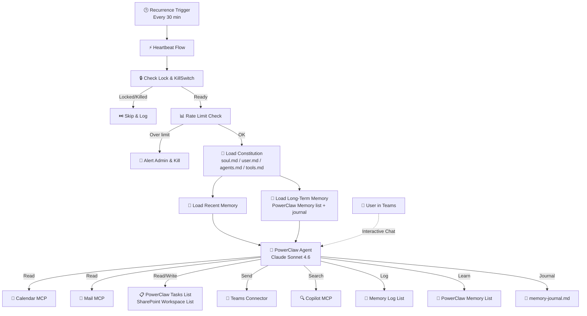

## PowerClaw Agent


## 📌 Overview
PowerClaw is an **autonomous AI chief of staff** for Microsoft 365. It runs on a scheduled heartbeat every 30 minutes to proactively monitor your calendar, email, and tasks so you can stay ahead of your day. A dedicated SharePoint site serves as PowerClaw's "brain" for memories, configuration, operating rules, and tasks.

PowerClaw supports two complementary modes:

- 🤖 **Autonomous** — Runs in the background, checks your calendar, manages tasks from a SharePoint Kanban board, and sends proactive briefings and alerts
- 💬 **Interactive** — Responds in Teams to prompts like *"brief me"*, *"create a task for..."*, or *"what's on my plate today?"*

Key capabilities include:

- 📅 Calendar-driven task execution
- 📋 SharePoint Kanban task board workflow
- 🧠 Long-term memory that learns preferences, people, and patterns over time
- 📧 Dark-themed professional email reports
- 🔔 Proactive intelligence for urgent email alerts, meeting prep, and trending content
- 🏠 Daily housekeeping and retention management
- ⚙️ Constitution files (`soul.md`, `user.md`, `agents.md`, `tools.md`) for customizable behavior and personality

For end-to-end setup instructions and troubleshooting, see [SETUP.md](SETUP.md). For the architecture deep-dive, see [HowItWorks.md](HowItWorks.md).

<!-- Screenshot: PowerClaw hero view showing the autonomous heartbeat, Teams interaction, and SharePoint workspace -->


📸 *Screenshots coming soon*

### Architecture at a glance



### What's in the package

| File/Folder | Purpose |
|-------------|---------|
| `PowerClaw/` | Copilot Studio solution source (agent, flows, connections, actions) |
| `Setup-PowerClaw.ps1` | SharePoint workspace provisioning script |
| `SETUP.md` | Detailed setup guide with troubleshooting |
| `HowItWorks.md` | Architecture deep-dive with screenshots |
| `Images/` | Screenshots and diagrams |
| `powerclaw-rounded.png` | Agent logo |

## 🙌 Credit
Built by **Alejandro Lopez** — [alejanl@microsoft.com](mailto:alejanl@microsoft.com)

## 📝 Pre-Requisites
| Requirement | Details |
|-------------|---------|
| Microsoft 365 | E3 or E5 (for Graph API, SharePoint, Teams) |
| Copilot Studio | Per-user or capacity-based license |
| Power Automate | Premium license (for Copilot Studio connector) |
| PnP PowerShell | Free module — setup script installs if missing |
| Permissions | Ability to create a SharePoint site |

## 🚀 Setup Agent
Use `Setup-PowerClaw.ps1` to provision the SharePoint workspace, then follow the detailed import and configuration steps in [SETUP.md](SETUP.md).

#### Name
```
PowerClaw
```

#### Icon


#### Description
```
Autonomous AI chief of staff for Microsoft 365 that runs on a scheduled heartbeat, monitors calendar, email, and tasks, uses SharePoint as its operating brain, and supports both proactive autonomous work and interactive Teams chat.
```

#### Agent Instructions
```
Instructions are embedded in the solution and dynamically loaded at runtime from the SharePoint constitution files soul.md, user.md, agents.md, and tools.md. They are not hardcoded in the published agent.
```

#### Orchestration
✅ Generative Orchestration

#### Response Model
✅ Claude Sonnet 4.6

#### Knowledge
- SharePoint workspace site used as PowerClaw's operational brain
- Constitution files: `soul.md`, `user.md`, `agents.md`, `tools.md`
- Memory Log list, PowerClaw Memory list, and `memory-journal.md`
- Open tasks from the SharePoint Kanban board
- Calendar, email, and user context loaded by the HeartbeatFlow

#### Tools
| Tool | Configuration Notes |
|------|-------------------|
| WorkIQ Calendar MCP | MCP · Use defaults |
| WorkIQ Mail MCP | MCP · Use defaults |
| WorkIQ Teams MCP | MCP · Use defaults |
| WorkIQ User MCP | MCP · Use defaults |
| WorkIQ Word MCP | MCP · Use defaults |
| WorkIQ Copilot MCP | MCP · Use defaults |
| Microsoft SharePoint Lists MCP | MCP · Use defaults |
| Office 365 Outlook - Send an email (V2) | Connector · Use defaults |
| Microsoft Teams - Post message | Connector · Use defaults |

#### Triggers
| Trigger | Configuration Notes |
|---------|-------------------|
| Recurrence (Power Automate) | Default: every 30 minutes. Configurable. |

## Example: Morning Briefing
PowerClaw emails a proactive morning summary of your calendar, tasks, and important emails so you can start the day with immediate context.

<!-- Screenshot: Morning briefing email summarizing today's schedule, tasks, and priority messages -->


📸 *Screenshots coming soon*

## Example: Task Execution
Add a task to the SharePoint Kanban board and PowerClaw picks it up, researches the request, prepares the deliverable, and emails it to you for review.

<!-- Screenshot: SharePoint Kanban task moving from To Do to Human Review with email deliverable -->


📸 *Screenshots coming soon*

## Example: Calendar-Driven Work
Create a calendar event such as *"Research Agent 365 for team presentation"* and PowerClaw uses that scheduled window to execute the work.

<!-- Screenshot: Calendar event driving a PowerClaw research task and resulting output -->


📸 *Screenshots coming soon*

## Example: Proactive Alerts
PowerClaw detects urgent email, upcoming meetings, or relevant trending content and sends a heads-up before the situation becomes urgent.

<!-- Screenshot: Proactive alert email or Teams message for urgent mail or meeting preparation -->


📸 *Screenshots coming soon*

## Version history
| Date | Comments | Author |
|------|----------|--------|
| March 2026 | Initial release | Alejandro Lopez - alejanl@microsoft.com |

## Disclaimer
**THIS CODE IS PROVIDED _AS IS_ WITHOUT WARRANTY OF ANY KIND, EITHER EXPRESS OR IMPLIED, INCLUDING ANY IMPLIED WARRANTIES OF FITNESS FOR A PARTICULAR PURPOSE, MERCHANTABILITY, OR NON-INFRINGEMENT.**
