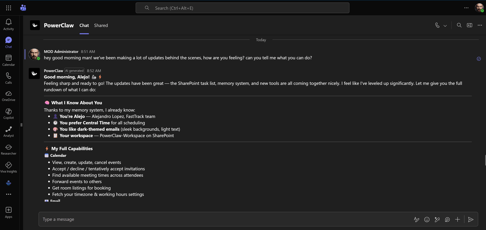
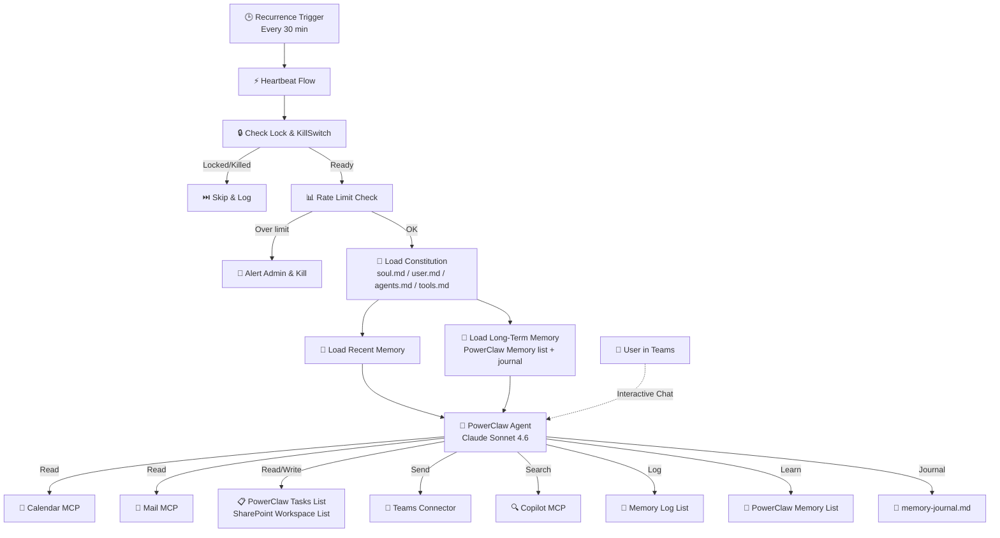
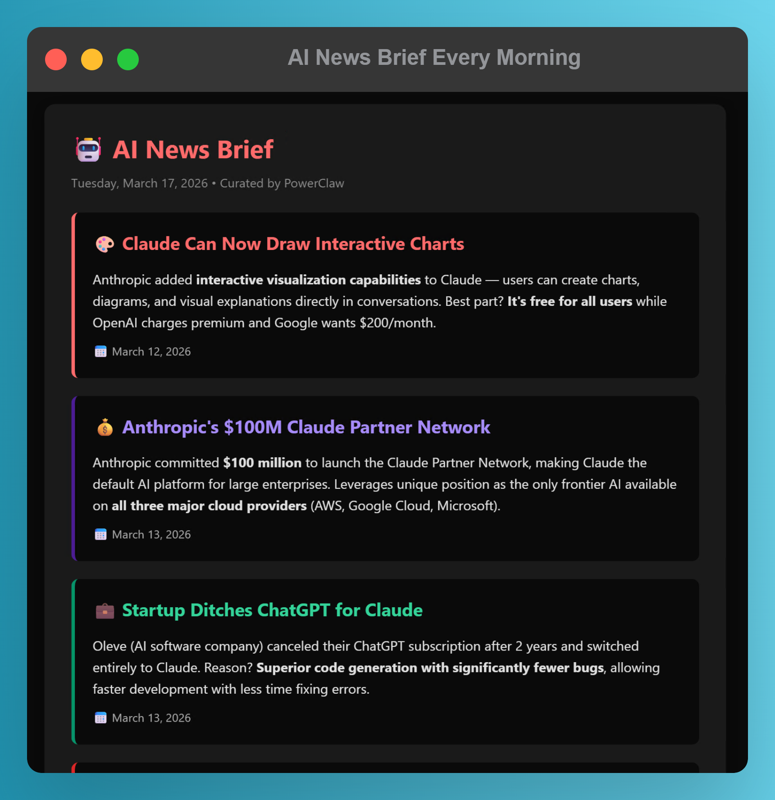
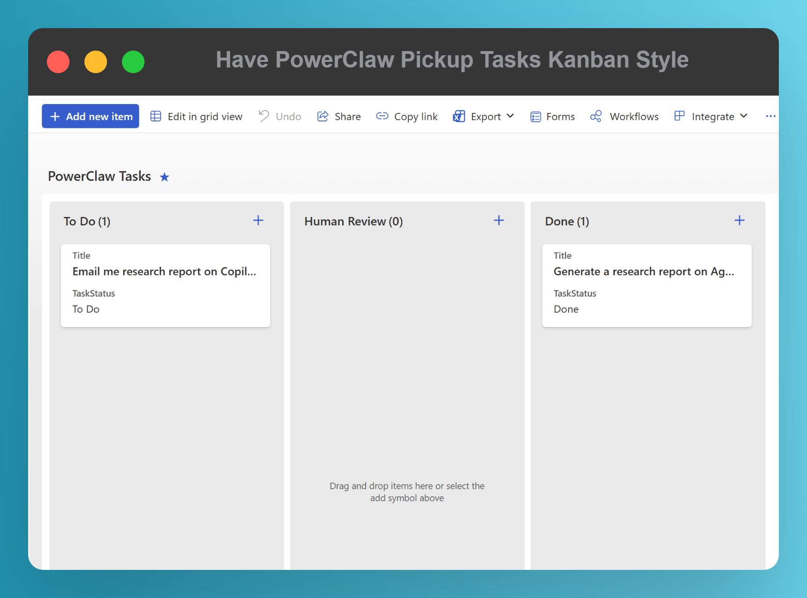
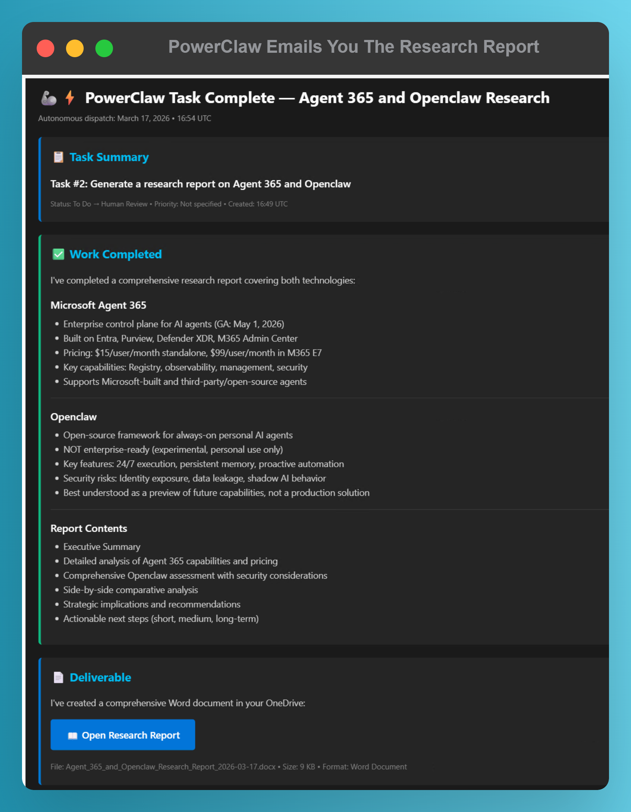
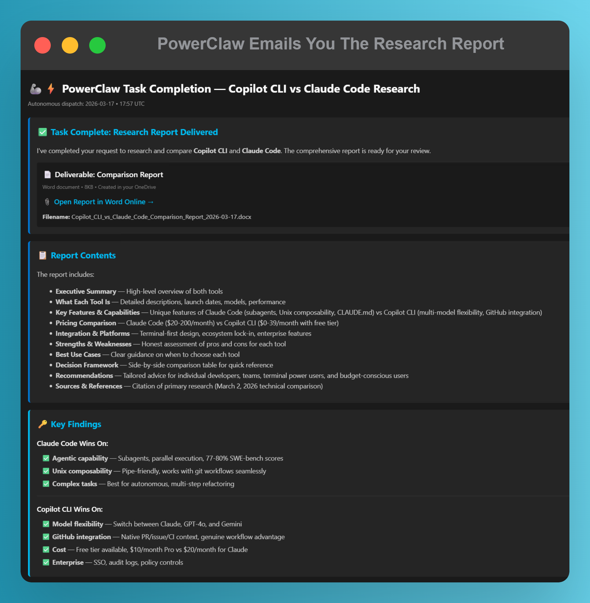
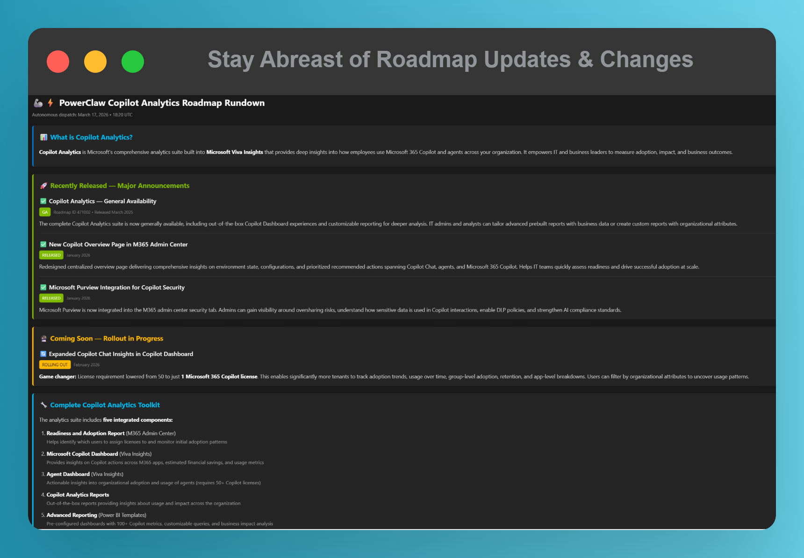
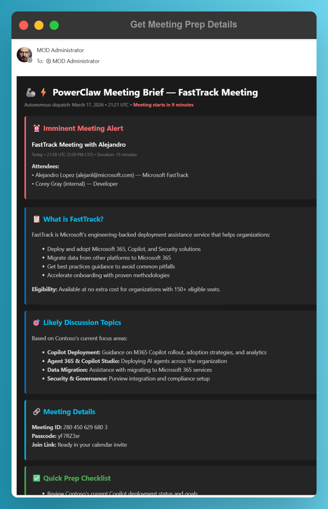

<p align="center">
  
</p>
<h1 align="center">PowerClaw Agent</h1>
<p align="center"><strong>Your 24/7 AI Chief of Staff — Built Entirely on Microsoft 365</strong></p>

<p align="center">
  
  
  
</p>

## 📌 Overview

PowerClaw is a personal AI assistant that runs on a 30-minute heartbeat — proactively monitoring your calendar, email, and tasks so you can stay ahead of your day. It uses a SharePoint site as its "brain" for memories, configuration, operating rules, and a task board.

**No manual Power Automate flows to build. No step-by-step workflow setup.** Just describe what you want in natural language — add a calendar event like *"Send me a Microsoft News Brief every morning at 8am"* — and PowerClaw handles the rest.


### Two modes

| Mode | How it works |
|-------|-------------|
| 💬 **Interactive** | Chat in Teams: *"brief me"*, *"create a task for..."*, *"what's on my plate today?"* |  
| 🤖 **Autonomous** | Background heartbeat checks your calendar, picks up tasks from a SharePoint Kanban board, and sends proactive briefings and alerts |


**🏷️ Interactive Example:** Uses WorkIQ for context on what's relevant to you. Uses Claude which is a great conversationalist. And adapts to your preferred working style using the Sould.md, User.md, etc. that you provide it.
<p align="center">
  
</p>

**🏷️ Autonomous Example:**  Operates 24/7 on a 30-min heartbeat and uses your calendar for event-driven tasks. Schedule PowerClaw to do X on your calendar while you sleep:
<p align="center">
  
</p>

### Key capabilities

- 📅 **Calendar-driven tasks** — Create a calendar event, PowerClaw executes during that window and emails you the deliverable
- 📋 **SharePoint Kanban board** — Simple task workflow: To Do → Human Review → Done
- 🧠 **Long-term memory** — Learns your preferences, people, and patterns over time
- 📧 **Professional email reports** — Dark-themed, clean, modern formatting
- 🔔 **Proactive intelligence** — Urgent email alerts, meeting prep, trending content
- ⚙️ **Constitution files** — Fully customizable personality and behavior via `soul.md`, `user.md`, `agents.md`, `tools.md`

### Built as a foundation

PowerClaw is intentionally lightweight — a solid base you can extend. Integrate it with Planner, To Do, or any Power Platform connector. Ask PowerClaw what tools it needs and it will guide you. Customize its context by editing the constitution files — your role, working style, goals — and it adapts accordingly.

📖 **[Setup Guide →](SETUP.md)**

---

## 🙌 Inspiration & Credit

PowerClaw is inspired by [**OpenClaw**](https://github.com/openclaw/openclaw), the open-source autonomous AI agent platform. OpenClaw demonstrates the incredible value of a 24/7 agent that can plan, execute, and learn — and we encourage you to check it out.

**Why PowerClaw?** OpenClaw is powerful but requires infrastructure beyond Microsoft 365 (local server, API keys, messaging gateway). PowerClaw brings the same *concept* — a heartbeat-driven autonomous agent that works while you sleep — but built **entirely within the M365 stack** you already have:

| | OpenClaw | PowerClaw |
|---|---------|-----------|
| **Infrastructure** | Local server + Docker + API keys | M365 + Copilot Studio + Power Automate |
| **Data residency** | Your machine | Your M365 tenant |
| **Security/compliance** | Self-managed | Inherits your M365 policies |
| **Chat interface** | WhatsApp, Telegram, Discord | Microsoft Teams |
| **Task assignment** | Chat commands | Calendar events + SharePoint Kanban + chat |
| **Setup** | Docker compose + config | Run PowerShell script (~15 min) |

> 💡 If security, compliance, or organizational policy is currently a blocker for running external AI infrastructure, PowerClaw gets you started with the same autonomous agent concept — using tools your IT team already approves.


### Architecture at a glance



### What's in the package

| File/Folder | Purpose |
|-------------|---------|
| `PowerClaw/` | Copilot Studio solution source (agent, flows, connections, actions) |
| `Setup-PowerClaw.ps1` | SharePoint workspace provisioning script |
| `SETUP.md` | Detailed setup guide with troubleshooting |
| `Images/` | Screenshots and diagrams |
| `powerclaw-rounded.png` | Agent logo |

## 📝 Pre-Requisites
| Requirement | Details |
|-------------|---------|
| Microsoft 365 | E3 or E5 (for Graph API, SharePoint, Teams) |
| Copilot Studio | Per-user or capacity-based license |
| Power Automate | Premium license (for Copilot Studio connector) |
| PnP PowerShell | Free module — setup script installs if missing |
| Permissions | Ability to create a SharePoint site |

## 🚀 Setup Agent
Use `Setup-PowerClaw.ps1` to provision the SharePoint workspace, then follow the detailed import and configuration steps in [SETUP.md](SETUP.md).

#### Name
```
PowerClaw
```

#### Icon


#### Description
```
24/7 Personal Assistant built on Microsoft 365 stack that runs on a scheduled heartbeat, monitors calendar, email, and tasks, uses SharePoint as its operating brain, and supports both proactive autonomous work and interactive Teams chat.
```

#### Agent Instructions
```
Instructions are embedded in the solution and dynamically loaded at runtime from the SharePoint constitution files soul.md, user.md, agents.md, and tools.md. They are not hardcoded in the published agent.
```

#### Orchestration
✅ Generative Orchestration

#### Response Model
✅ Claude Sonnet 4.6

#### Knowledge
- SharePoint workspace site used as PowerClaw's operational brain
- Constitution files: `soul.md`, `user.md`, `agents.md`, `tools.md`
- Memory Log list, PowerClaw Memory list, and `memory-journal.md`
- Open tasks from the SharePoint Kanban board
- Calendar, email, and user context loaded by the HeartbeatFlow

#### Tools
| Tool | Configuration Notes |
|------|-------------------|
| WorkIQ Calendar MCP | MCP · Use defaults |
| WorkIQ Mail MCP | MCP · Use defaults |
| WorkIQ Teams MCP | MCP · Use defaults |
| WorkIQ User MCP | MCP · Use defaults |
| WorkIQ Word MCP | MCP · Use defaults |
| WorkIQ Copilot MCP | MCP · Use defaults |
| Microsoft SharePoint Lists MCP | MCP · Use defaults |
| Office 365 Outlook - Send an email (V2) | Connector · Use defaults |
| Microsoft Teams - Post message | Connector · Use defaults |

#### Triggers
| Trigger | Configuration Notes |
|---------|-------------------|
| Recurrence (Power Automate) | Default: every 30 minutes. Configurable. |

---

## 📸 Examples

### Morning Work Briefing
Start your day with an automated summary of today's calendar, pending tasks, and important emails — delivered before you even open Outlook.


### AI News Briefing on a Schedule
Want the latest AI news in your inbox every morning at 8am? Just add a recurring calendar event. No Power Automate flow to build — just natural language.



### Research Task Execution via Kanban Board
Add a task to the SharePoint board. PowerClaw picks it up, researches the topic, creates a Word document, saves it to OneDrive, and emails you a link — then moves the task to "Human Review."







> 💡 Want a research report by tomorrow morning? Add it to your calendar for the time window you want it done — PowerClaw will execute during that window and email the deliverable with a link to the Word doc in your OneDrive for Business.

### Stay on Top of Product Changes
Have PowerClaw send you a Roadmap Rundown on new Microsoft 365 product releases so you stay abreast of upcoming changes.



### Proactive Meeting Prep
PowerClaw detects an upcoming meeting, checks the attendees, reviews recent emails, and sends you prep notes before the meeting starts.



## Version history
| Date | Comments | Author |
|------|----------|--------|
| March 2026 | Initial release | Alejandro Lopez - alejanl@microsoft.com |

## Disclaimer
**THIS CODE IS PROVIDED _AS IS_ WITHOUT WARRANTY OF ANY KIND, EITHER EXPRESS OR IMPLIED, INCLUDING ANY IMPLIED WARRANTIES OF FITNESS FOR A PARTICULAR PURPOSE, MERCHANTABILITY, OR NON-INFRINGEMENT.**
