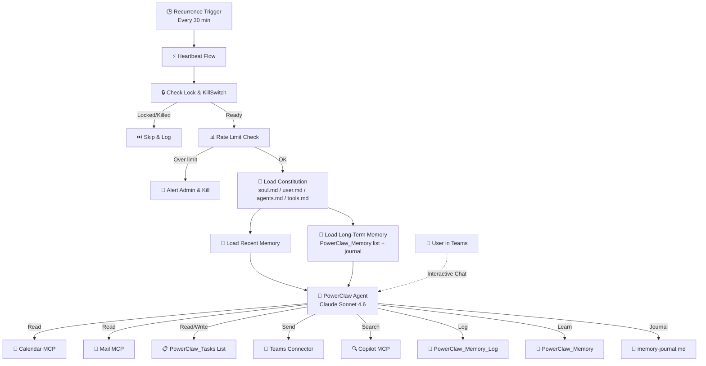

# 🦀 PowerClaw Setup Guide

<p align="center">
  
</p>

<p align="center"><strong>From zero to first heartbeat in ~30 minutes</strong></p>

---

## Quick-Start Checklist

> Follow these eight steps in order. Each one expands with full details below.

- [ ] **1.** [Create a SharePoint site](#step-1-create-sharepoint-site)
- [ ] **2.** [Import the solution](#step-2-import-the-solution)
- [ ] **3.** [Manage connections](#step-3-manage-connections)
- [ ] **4.** [Configure flows](#step-4-configure-flows)
- [ ] **5.** [Provision the workspace](#step-5-provision-the-workspace)
- [ ] **6.** [Verify tools in Copilot Studio](#step-6-verify-tools)
- [ ] **7.** [Personalize your agent](#step-7-personalize-your-agent)
- [ ] **8.** [Verify it's working](#step-8-verify-its-working)

<details>
<summary><strong>📋 Prerequisites</strong></summary>

| Requirement | Details |
|---|---|
| **Microsoft 365** | E3 or E5 (for SharePoint, Teams, Outlook, Graph API) |
| **Copilot Studio** | Credit pack or pay-as-you-go — [see pricing](https://aka.ms/copilotstudio/licensingguide) |
| **Power Automate** | Premium plan — required because HeartbeatFlow uses the Copilot Studio connector |
| **Permissions** | Ability to create a SharePoint site |
| **PnP PowerShell** | *Optional* — only needed for the backup script path, which also requires an app registration + admin consent |

</details>

---

## Step 1: Create SharePoint Site

PowerClaw needs a dedicated SharePoint site as its workspace.

1. Create a new **SharePoint Team site** (e.g., `https://contoso.sharepoint.com/sites/PowerClaw-Workspace`)
2. Ensure the account importing the solution has **Owner or Edit** permissions on this site
3. Note the **Site URL** — you'll need it in Steps 4 and 5

---

## Step 2: Import the Solution

1. Go to [**Power Apps Maker Portal**](https://make.powerapps.com)
2. Select your environment
3. Click **Solutions** → **Import solution**
4. Upload the `PowerClaw_Solution.zip` file
5. **Map Connections** — you'll be prompted to authorize:
   - SharePoint Online
   - Office 365 Outlook
   - Microsoft Teams
   - Microsoft Copilot Studio
   - WorkIQ MCP servers (Calendar, Mail, Teams, User, Word, Copilot)
6. **Environment Variables** — if environment variables appear during import, it's fine to enter your actual SharePoint site URL and admin email from Step 1, but the flows themselves are configured in **Step 4: Configure Flows** using Compose actions

> ℹ️ **Expected warning:** You may see *"Solution imported successfully with warnings: The original workflow definition has been deactivated and replaced."* This is normal — all flows are imported in an **OFF** state so you can complete setup before activating them.

---

## Step 3: Manage Connections

Before running any flows, verify that all connection references are properly linked.

1. Go to [**Power Apps Maker Portal**](https://make.powerapps.com) → **Solutions** → **PowerClaw**
2. Click **Connection References** in the left nav (or filter by type)
3. For each connection reference, click it and verify a valid connection is selected
   - If no connection exists, click **+ New connection**, authenticate, and select it
4. Repeat for all connection references (SharePoint, Outlook, Teams, Copilot Studio)

> 💡 This ensures all flows can authenticate when turned on. Skipping this step is the most common cause of flow failures.

---

## Step 4: Configure Flows

After importing the solution and setting up connections, configure the flows to point at your workspace.

1. Go to **Power Automate** → **My flows** (or find the flows in the **PowerClaw** solution)
2. Open **Heartbeat Flow** → click **Edit**
3. Find the **`Compose:_Config_SiteURL`** action near the top of the flow
4. Replace `https://contoso.sharepoint.com/sites/PowerClaw-Workspace` with your actual SharePoint site URL from Step 1
5. Find the **`Compose:_Config_AdminEmail`** action
6. Replace `admin@contoso.com` with your email address
7. Click **Save**
8. Repeat for the **GetContext** flow — update **`Compose:_Config_SiteURL`** only (no email change needed)
9. Repeat for the **Housekeeping** flow — update **`Compose:_Config_SiteURL`** only

> 💡 This is the only manual flow configuration needed. All SharePoint actions in the flows automatically use these Compose values.

---

## Step 5: Provision the Workspace

Choose **one** provisioning path to create the SharePoint lists and constitution files. All three paths target the same workspace shape:

1. **Bootstrap Flow** *(recommended)* — run after importing the solution
2. **PowerShell Script** *(backup)* — for DLP-restricted environments; requires app registration + admin consent
3. **Manual Setup** *(universal fallback)* — browser-only, zero dependencies

### Option A: Bootstrap Flow *(Recommended — run after solution import)*

The solution includes a helper flow that provisions everything — no scripts required.

1. Go to **Power Automate** → **My flows**
2. Find the **Bootstrap** flow (inside the PowerClaw solution)
3. Click **Run** and enter:
    - **SiteUrl** — the SharePoint site URL from Step 1
    - **AdminEmail** — your email address
    - **AgentName** — name for your agent (default: "PowerClaw")
4. The flow creates all lists, columns, and uploads the default constitution files

> 💡 **Tip:** The Bootstrap flow is separate from the Compose-based flow configuration in Step 4. It uses its own run inputs — **SiteUrl**, **AdminEmail**, and **AgentName** — which you enter when running the flow. **AgentName** defaults to "PowerClaw" if left blank.

<details>
<summary><strong>Option B: PowerShell Script (Backup — DLP-restricted environments)</strong></summary>

Use this when the Bootstrap flow is blocked but you can obtain app registration + admin consent for delegated SharePoint access.

**1. Register a PnP PowerShell app** (one-time per tenant):

```powershell
Register-PnPEntraIDAppForInteractiveLogin `
  -ApplicationName "PowerClaw Setup" `
  -Tenant yourtenant.onmicrosoft.com `
  -DeviceLogin `
  -SharePointDelegatePermissions AllSites.Manage
```

This requests **only** the permission needed. The consent screen will show **"read and write items and lists in all site collections"** (`AllSites.Manage`) — that is expected and acceptable for this setup. Save the **Client ID** it outputs.

**2. Run the provisioning script:**

```powershell
.\scripts\Setup-PowerClaw.ps1 `
  -SiteUrl "https://your-tenant.sharepoint.com/sites/PowerClaw-Workspace" `
  -AdminEmail "you@example.com" `
  -ClientId "your-client-id" `
  -AgentName "PowerClaw"
```

</details>

<details>
<summary><strong>Option C: Manual Setup (Universal fallback)</strong></summary>

Use this when you want a browser-only path with zero script dependencies.

- Follow [`docs/MANUAL-SETUP.md`](docs/MANUAL-SETUP.md)
- Estimated time: **~15 minutes**
- Works anywhere you can create SharePoint lists and upload files

</details>

<details>
<summary><strong>What gets created</strong></summary>

Regardless of method, the following resources are provisioned:

- ✅ **PowerClaw_Memory_Log** list — audit trail for all agent activity
- ✅ **PowerClaw_Config** list — heartbeat safeguards and admin contact settings
  - Seeded items: `KillSwitch = false`, `IsRunning = false`, `MaxActionsPerHour = 20`, `AdminEmail = <your email>`
- ✅ **PowerClaw_Memory** list — long-term knowledge store (preferences, people, projects)
- ✅ **PowerClaw_Tasks** list — task workflow: `To Do → Human Review → Done`
- ✅ **Constitution files** uploaded to Shared Documents:
  - `soul.md` — Agent personality and core values
  - `user.md` — Your role, team, and preferences
  - `agents.md` — Operating rules (calendar, email triage, task management, notifications)
  - `tools.md` — Available capabilities reference
  - `memory-journal.md` — Rolling narrative journal

> **Automatic retention:** A daily Housekeeping flow removes old log entries and completed tasks after 30 days, expires stale memories, and trims `memory-journal.md`.

</details>

### Activate the Flows

After provisioning completes, turn on the flows **in this specific order**:

1. **Bootstrap** — This is a manual instant flow. You already ran it in the step above. No need to turn it on/off — it runs on demand.
2. **HeartbeatFlow** — Turn on only after Bootstrap has succeeded. This is the recurring 30-minute heartbeat.
3. **HousekeepingFlow** — Turn on anytime after Bootstrap. This handles daily cleanup of old logs, completed tasks, and memory trimming.

> ⚠️ Do **not** turn on HeartbeatFlow before Bootstrap has run successfully — the heartbeat depends on the SharePoint lists and files that Bootstrap creates.

---

## Step 6: Verify Tools

Open the agent in [**Copilot Studio**](https://copilotstudio.microsoft.com) and confirm these **9 tools** are enabled:

| Tool | Type |
|---|---|
| WorkIQ Calendar MCP | MCP |
| WorkIQ Mail MCP | MCP |
| WorkIQ Teams MCP | MCP |
| WorkIQ User MCP | MCP |
| WorkIQ Word MCP | MCP |
| WorkIQ Copilot MCP | MCP |
| WorkIQ SharePoint MCP | MCP |
| Office 365 Outlook - Send email (V2) | Connector |
| Microsoft Teams - Post message | Connector |

> 💡 No extra task connectors needed — PowerClaw manages tasks directly via the WorkIQ SharePoint MCP.

---

## Step 7: Personalize Your Agent

PowerClaw's personality and operating rules are fully decoupled from code. Edit these markdown files in your SharePoint **Documents** library:

| File | Action | What it controls |
|---|---|---|
| `user.md` | **Required** — fill in | Your name, role, team, manager, preferences, focus time |
| `agents.md` | Review defaults | Operating rules: calendar monitoring, email triage, digest schedule, quiet hours |
| `soul.md` | Optional | Personality, core values, communication style |
| `tools.md` | Reference | Available capabilities — update if you add/remove tools |

> 🎨 **Custom icon:** To change the agent's avatar, upload a custom icon through the **Copilot Studio UI** under the agent's channel settings. Icon upload is not supported via YAML or solution import.

---

## Step 8: Verify It's Working

Run through these checks to confirm everything is connected:

| Test | What to do | Expected result |
|---|---|---|
| **Config check** | Open the PowerClaw_Config list | `KillSwitch = false`, `IsRunning = false`, `MaxActionsPerHour = 20`, `AdminEmail = <your email>` |
| **Interactive chat** | Say *"Hi, what can you do?"* in Teams | Natural language response (not JSON) |
| **Briefing** | Say *"brief me"* in Teams | Calendar + tasks + email summary |
| **Task execution** | Add an item with `TaskStatus = To Do` to the PowerClaw_Tasks list, then trigger the Heartbeat Flow | "Starting" email → task moves to "Human Review" |
| **Heartbeat** | Trigger the Heartbeat Flow manually | New entries in Memory_Log, PowerClaw_Memory, and memory-journal.md |

After verification, the heartbeat runs automatically every 30 minutes.

---

## Customize & Configure

<details>
<summary><strong>⚙️ Configuration Reference</strong></summary>

### PowerClaw_Config List Settings

| Setting | Default | Purpose |
|---|---|---|
| **KillSwitch** | `false` | Emergency stop for all autonomous activity |
| **IsRunning** | `false` | Runtime coordination flag used by the heartbeat |
| **MaxActionsPerHour** | `20` | Rate limit safety valve |
| **AdminEmail** | `you@example.com` | Admin contact for alerts and setup ownership |

### Common Customizations

- **Heartbeat frequency** — Edit the Power Automate recurrence trigger
- **Operating rules** — Edit `agents.md` to add/change behaviors (no code needed)
- **Kill switch** — Set `KillSwitch = true` in PowerClaw_Config to pause all autonomous activity
- **Agent name** — Update `soul.md` (or rerun Bootstrap / setup with `AgentName`)
- **Long-term memory** — Review the PowerClaw_Memory list to see what the agent has learned; edit or delete entries to correct its knowledge

### Calendar-Driven Routines 📅

PowerClaw can execute recurring tasks based on your calendar. Add a calendar event with **`[PowerClaw Routine]`** in the title, and describe the task in the event body. PowerClaw will execute it during that time window.

**Example — Morning AI News Brief:**

| Field | Value |
|---|---|
| **Subject** | `[PowerClaw Routine] Morning AI News Brief` |
| **Body** | `Research what's the latest in AI News. Anything interesting or exciting send to me via Email. Format it well for readability, use a dark theme, and make it engaging.` |
| **When** | Recurring daily, 8:00 AM – 8:30 AM |

> 💡 **Tips:**
> - The `[PowerClaw Routine]` tag in the title is required — PowerClaw scans for this exact tag
> - Make the body descriptive — this is the instruction PowerClaw follows
> - Set the event to the time window when you want the task executed
> - PowerClaw checks Sent Items to avoid duplicate execution if the heartbeat fires twice in the same window

### Data Retention

| Data Type | Retention | Action |
|---|---|---|
| **PowerClaw_Memory_Log** | 30 days | Deleted |
| **Done Tasks** | 30 days | Deleted |
| **Active Memories** | Max 100 | Lowest confidence archived |
| **memory-journal.md** | 50 KB | Truncated to recent content |

</details>

<details>
<summary><strong>📋 PowerClaw_Tasks — How the Board Works</strong></summary>

PowerClaw uses a SharePoint list called **PowerClaw_Tasks** as its task board. The setup process creates this automatically.

**Columns:** Title · TaskStatus · TaskDescription · Priority · Source · DueDate · Notes · LastActionDate

**Workflow:**

```
📋 To Do          → PowerClaw picks up to 2 tasks per heartbeat
                     Sends a "Starting" email with initial analysis
                     Works the task using M365 tools
                     When ready, moves task to ↓

👁️ Human Review   → PowerClaw sends deliverable email and waits
                     You review, request edits, or approve
                     When satisfied, mark as ↓

✅ Done           → Complete — no further action
```

### Create a Kanban Board View

1. Open the **PowerClaw_Tasks** list → click the view dropdown → **Create new view**
2. Choose **Board** as the view type, name it **"Board"**
3. Set **Group by** → **TaskStatus**
4. *(Optional)* Show **Priority** and **DueDate** on cards via card settings
5. Click **Save**

You'll get a drag-and-drop Kanban board: **To Do → Human Review → Done**.

</details>

<details>
<summary><strong>🏗️ Agent Configuration Reference</strong></summary>

These settings are pre-configured in the imported solution. Reference only — no changes needed for basic setup.

### Name
```
PowerClaw
```

### Icon


### Description
```
24/7 Personal Assistant built on Microsoft 365 stack that runs on a scheduled heartbeat,
monitors calendar, email, and tasks, uses SharePoint as its operating brain, and supports
both proactive autonomous work and interactive Teams chat.
```

### Agent Instructions
```
Instructions are embedded in the solution and dynamically loaded at runtime from the
SharePoint constitution files soul.md, user.md, agents.md, and tools.md.

In Interactive Mode (Teams / M365 Copilot), constitution files are loaded just-in-time
on the first user message via the ConversationInit topic, which calls the GetContext flow.
A JIT guard (IsBlank check) ensures the flow runs only once per conversation.

In Autonomous Mode (Heartbeat), the HeartbeatFlow loads constitution files independently
from SharePoint and injects them directly into the prompt.
```

### Settings
- **Orchestration:** Generative
- **Response Model:** Claude Sonnet 4.6
- **Trigger:** Recurrence (Power Automate) — every 30 minutes

### Knowledge Sources
- SharePoint workspace site (operational brain)
- Constitution files: `soul.md`, `user.md`, `agents.md`, `tools.md`
- Memory Log list, PowerClaw_Memory list, `memory-journal.md`
- Open tasks from the PowerClaw_Tasks list
- Calendar, email, and user context loaded by the HeartbeatFlow

</details>

---

## Updating an Existing Installation

To update PowerClaw to a newer version:

1. Download the latest `PowerClaw_Solution.zip`
2. Re-import into your existing environment (same steps as [Step 2](#step-2-import-the-solution))
3. **Re-authorize connections** if prompted
4. **Re-edit `Compose:_Config_SiteURL`** in HeartbeatFlow, GetContext, and Housekeeping with your site URL
5. **Turn on** HeartbeatFlow and HousekeepingFlow (they are deactivated on import)

> ⚠️ **Do not re-run the Bootstrap flow** — your SharePoint lists and constitution files are already in place. Re-running Bootstrap may create duplicate lists or overwrite your customized constitution files.

Your SharePoint data (config settings, memories, tasks, constitution files) is fully preserved during solution re-import.

---

## Troubleshooting

<details>
<summary><strong>🚑 Common Issues</strong></summary>

| Issue | Check |
|---|---|
| **Heartbeat skipped** | Is `KillSwitch` set to `true` in PowerClaw_Config? Reset to `false`. |
| **Flow fails / No response** | Check **Connections** in Power Automate — they may need re-authentication. |
| **Lock stuck** | If `IsRunning` is `true` for 35+ minutes, stale lock recovery auto-fixes on next heartbeat. Or manually set to `false`. |
| **Agent returns JSON in chat** | The message must NOT start with `[HEARTBEAT EVENT TRIGGERED]` for interactive mode. |
| **Duplicate task emails** | Check PowerClaw_Memory for entries with scopeKey starting with `task:`. Delete stale entries. |
| **Rate limit triggered** | Check `MaxActionsPerHour` in PowerClaw_Config. Reset `KillSwitch` to `false` after reviewing. |
| **Permissions errors** | Ensure the flow account has Edit access to the SharePoint site and all connections are authorized. |
| **Memory not saving** | Verify the PowerClaw_Memory list exists. Check the list GUID in HeartbeatFlow. Ensure `memory-journal.md` exists in Shared Documents. |

</details>

---

## Architecture

<details>
<summary><strong>📐 How PowerClaw Works Under the Hood</strong></summary>

### Memory Architecture

PowerClaw uses three tiers of memory:

1. **PowerClaw_Memory_Log (Short-Term)** — Audit trail of recent actions (last 25 entries)
2. **PowerClaw_Memory (Semantic)** — Specific facts about preferences, people, and projects
3. **Memory Journal (Episodic)** — Rolling narrative of observations and insights

### Execution Priority (Each Heartbeat)

1. **Calendar Routines** — Events flagged for PowerClaw (e.g., "Morning Briefing")
2. **Proactive Intelligence** — Urgent emails or upcoming meetings
3. **Task Management** — Up to 2 "To Do" tasks per heartbeat
4. **Observations** — Updates long-term memory with new insights

### System Flow



</details>

---

## What's in the Package

| File | Purpose |
|---|---|
| `PowerClaw_Solution.zip` | Unmanaged solution (Agent + Flows including Bootstrap) |
| `scripts/Setup-PowerClaw.ps1` | SharePoint workspace provisioning script (backup path; requires app registration + admin consent) |
| `docs/MANUAL-SETUP.md` | Universal browser-only manual setup guide |
| `SETUP.md` | This guide |
| `Images/` | Screenshots and diagrams |

---

<p align="center">
  <br/>
  <em>PowerClaw — Your autonomous AI chief of staff</em><br/>
  Built with 🦀 by the PowerClaw Team
</p>
