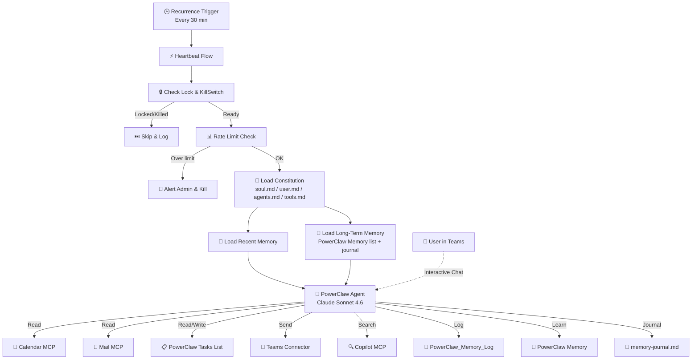

# 🦀 PowerClaw Setup Guide

<p align="center">
  
</p>

<p align="center"><strong>From zero to first heartbeat in ~15 minutes</strong></p>

---

## Quick-Start Checklist

> Follow these six steps in order. Each one expands with full details below.

- [ ] **1.** [Create a SharePoint site](#step-1-create-sharepoint-site)
- [ ] **2.** [Import the solution](#step-2-import-the-solution)
- [ ] **3.** [Provision the workspace](#step-3-provision-the-workspace)
- [ ] **4.** [Verify tools in Copilot Studio](#step-4-verify-tools)
- [ ] **5.** [Personalize your agent](#step-5-personalize-your-agent)
- [ ] **6.** [Verify it's working](#step-6-verify-its-working)

<details>
<summary><strong>📋 Prerequisites</strong></summary>

| Requirement | Details |
|---|---|
| **Microsoft 365** | E3 or E5 (for Graph API, SharePoint, Teams) |
| **Copilot Studio** | Per-user or capacity-based license |
| **Power Automate** | Premium license (for Copilot Studio connector) |
| **Permissions** | Ability to create a SharePoint site |
| **PnP PowerShell** | *Optional* — only needed if using the script-based setup path |

</details>

---

## Step 1: Create SharePoint Site

PowerClaw needs a dedicated SharePoint site as its workspace.

1. Create a new **SharePoint Team site** (e.g., `https://contoso.sharepoint.com/sites/PowerClaw-Workspace`)
2. Note the **Site URL** — you'll need it in Step 3

---

## Step 2: Import the Solution

1. Go to [**Power Apps Maker Portal**](https://make.powerapps.com)
2. Select your environment
3. Click **Solutions** → **Import solution**
4. Upload the `PowerClaw_Solution.zip` file
5. **Map Connections** — you'll be prompted to authorize:
   - SharePoint Online
   - Office 365 Outlook
   - Microsoft Teams
   - Microsoft Copilot Studio
   - WorkIQ MCP servers (Calendar, Mail, Teams, User, Word, Copilot)
6. **Environment Variables** — enter the SharePoint site URL from Step 1 and your admin email

---

## Step 3: Provision the Workspace

Choose one method to create the SharePoint lists and constitution files.

### Option A: Bootstrap Flow *(Recommended)*

The solution includes a helper flow that provisions everything — no scripts required.

1. Go to **Power Automate** → **My flows**
2. Find the **Bootstrap** flow (inside the PowerClaw solution)
3. Click **Run** and enter:
   - **SiteUrl** — the SharePoint site URL from Step 1
   - **AdminEmail** — your email address
   - **AgentName** — name for your agent (default: "PowerClaw")
4. The flow creates all lists, columns, and uploads the default constitution files

> *AgentName personalizes how the agent refers to itself in conversations and constitution files. Product branding (email subjects, calendar tags) stays as "PowerClaw".*

<details>
<summary><strong>Option B: PowerShell (Advanced)</strong></summary>

For admins who prefer scripting or need to customize the setup.

**1. Register a PnP PowerShell app** (one-time per tenant):

```powershell
Register-PnPEntraIDAppForInteractiveLogin `
  -ApplicationName "PowerClaw Setup" `
  -Tenant yourtenant.onmicrosoft.com `
  -DeviceLogin `
  -SharePointDelegatePermissions AllSites.Manage
```

This requests **only** the permission needed. Save the **Client ID** it outputs.

**2. Run the provisioning script:**

```powershell
.\Setup-PowerClaw.ps1 `
  -SiteUrl "https://your-tenant.sharepoint.com/sites/PowerClaw-Workspace" `
  -AdminEmail "you@example.com" `
  -ClientId "your-client-id" `
  -AgentName "PowerClaw"
```

</details>

<details>
<summary><strong>What gets created</strong></summary>

Regardless of method, the following resources are provisioned:

- ✅ **PowerClaw_Memory_Log** list — audit trail for all agent activity
- ✅ **PowerClaw_Config** list — configuration flags (KillSwitch, rate limits, quiet hours)
- ✅ **PowerClaw Memory** list — long-term knowledge store (preferences, people, projects)
- ✅ **PowerClaw Tasks** list — task workflow: `To Do → Human Review → Done`
- ✅ **Constitution files** uploaded to Shared Documents:
  - `soul.md` — Agent personality and core values
  - `user.md` — Your role, team, and preferences
  - `agents.md` — Operating rules (calendar, email triage, task management, digest schedule)
  - `tools.md` — Available capabilities reference
  - `memory-journal.md` — Rolling narrative journal

> **Automatic retention:** A daily Housekeeping flow removes old log entries and completed tasks after 30 days, expires stale memories, and trims `memory-journal.md`.

</details>

---

## Step 4: Verify Tools

Open the agent in [**Copilot Studio**](https://copilotstudio.microsoft.com) and confirm these **9 tools** are enabled:

| Tool | Type |
|---|---|
| WorkIQ Calendar MCP | MCP |
| WorkIQ Mail MCP | MCP |
| WorkIQ Teams MCP | MCP |
| WorkIQ User MCP | MCP |
| WorkIQ Word MCP | MCP |
| WorkIQ Copilot MCP | MCP |
| Microsoft SharePoint Lists MCP | MCP |
| Office 365 Outlook - Send email (V2) | Connector |
| Microsoft Teams - Post message | Connector |

> 💡 No extra task connectors needed — PowerClaw manages tasks directly via the SharePoint Lists MCP.

---

## Step 5: Personalize Your Agent

PowerClaw's personality and operating rules are fully decoupled from code. Edit these markdown files in your SharePoint **Documents** library:

| File | Action | What it controls |
|---|---|---|
| `user.md` | **Required** — fill in | Your name, role, team, manager, preferences, focus time |
| `agents.md` | Review defaults | Operating rules: calendar monitoring, email triage, digest schedule, quiet hours |
| `soul.md` | Optional | Personality, core values, communication style |
| `tools.md` | Reference | Available capabilities — update if you add/remove tools |

---

## Step 6: Verify It's Working

Run through these checks to confirm everything is connected:

| Test | What to do | Expected result |
|---|---|---|
| **Config check** | Open the PowerClaw_Config list | `KillSwitch = false`, `IsRunning = false` |
| **Interactive chat** | Say *"Hi, what can you do?"* in Teams | Natural language response (not JSON) |
| **Briefing** | Say *"brief me"* in Teams | Calendar + tasks + email summary |
| **Task execution** | Add an item with `TaskStatus = To Do` to the PowerClaw Tasks list, then trigger the Heartbeat Flow | "Starting" email → task moves to "Human Review" |
| **Heartbeat** | Trigger the Heartbeat Flow manually | New entries in Memory_Log, PowerClaw Memory, and memory-journal.md |

After verification, the heartbeat runs automatically every 30 minutes.

---

## Customize & Configure

<details>
<summary><strong>⚙️ Configuration Reference</strong></summary>

### PowerClaw_Config List Settings

| Setting | Default | Purpose |
|---|---|---|
| **KillSwitch** | `false` | Emergency stop for all autonomous activity |
| **MaxActionsPerHour** | `10` | Rate limit safety valve |
| **HeartbeatIntervalMinutes** | `30` | Frequency of the flow trigger |
| **DigestTimeUTC** | `08:00` | When to send the daily digest |
| **QuietHoursStart** | `22:00` | Start of quiet hours (UTC) |
| **QuietHoursEnd** | `07:00` | End of quiet hours (UTC) |
| **MemoryMaxActiveItems** | `100` | Cap on active long-term memories loaded |

### Common Customizations

- **Heartbeat frequency** — Edit the Power Automate recurrence trigger
- **Operating rules** — Edit `agents.md` to add/change behaviors (no code needed)
- **Kill switch** — Set `KillSwitch = true` in PowerClaw_Config to pause all autonomous activity
- **Agent name** — Change `AgentName` in PowerClaw_Config and update `soul.md`
- **Long-term memory** — Review the PowerClaw Memory list to see what the agent has learned; edit or delete entries to correct its knowledge

### Data Retention

| Data Type | Retention | Action |
|---|---|---|
| **PowerClaw_Memory_Log** | 30 days | Deleted |
| **Done Tasks** | 30 days | Deleted |
| **Active Memories** | Max 100 | Lowest confidence archived |
| **memory-journal.md** | 50 KB | Truncated to recent content |

</details>

<details>
<summary><strong>📋 PowerClaw Tasks — How the Board Works</strong></summary>

PowerClaw uses a SharePoint list called **PowerClaw Tasks** as its task board. The setup process creates this automatically.

**Columns:** Title · TaskStatus · TaskDescription · Priority · Source · DueDate · Notes · LastActionDate · CompletedDate

**Workflow:**

```
📋 To Do          → PowerClaw picks up to 2 tasks per heartbeat
                     Sends a "Starting" email with initial analysis
                     Works the task using M365 tools
                     When ready, moves task to ↓

👁️ Human Review   → PowerClaw sends deliverable email and waits
                     You review, request edits, or approve
                     When satisfied, mark as ↓

✅ Done           → Complete — no further action
```

### Create a Kanban Board View

1. Open the **PowerClaw Tasks** list → click the view dropdown → **Create new view**
2. Choose **Board** as the view type, name it **"Board"**
3. Set **Group by** → **TaskStatus**
4. *(Optional)* Show **Priority** and **DueDate** on cards via card settings
5. Click **Save**

You'll get a drag-and-drop Kanban board: **To Do → Human Review → Done**.

</details>

<details>
<summary><strong>🏗️ Agent Configuration Reference</strong></summary>

These settings are pre-configured in the imported solution. Reference only — no changes needed for basic setup.

### Name
```
PowerClaw
```

### Icon


### Description
```
24/7 Personal Assistant built on Microsoft 365 stack that runs on a scheduled heartbeat,
monitors calendar, email, and tasks, uses SharePoint as its operating brain, and supports
both proactive autonomous work and interactive Teams chat.
```

### Agent Instructions
```
Instructions are embedded in the solution and dynamically loaded at runtime from the
SharePoint constitution files soul.md, user.md, agents.md, and tools.md.
They are not hardcoded in the published agent.
```

### Settings
- **Orchestration:** Generative
- **Response Model:** Claude Sonnet 4.6
- **Trigger:** Recurrence (Power Automate) — every 30 minutes

### Knowledge Sources
- SharePoint workspace site (operational brain)
- Constitution files: `soul.md`, `user.md`, `agents.md`, `tools.md`
- Memory Log list, PowerClaw Memory list, `memory-journal.md`
- Open tasks from the PowerClaw Tasks list
- Calendar, email, and user context loaded by the HeartbeatFlow

</details>

---

## Troubleshooting

<details>
<summary><strong>🚑 Common Issues</strong></summary>

| Issue | Check |
|---|---|
| **Heartbeat skipped** | Is `KillSwitch` set to `true` in PowerClaw_Config? Reset to `false`. |
| **Flow fails / No response** | Check **Connections** in Power Automate — they may need re-authentication. |
| **Lock stuck** | If `IsRunning` is `true` for 35+ minutes, stale lock recovery auto-fixes on next heartbeat. Or manually set to `false`. |
| **Agent returns JSON in chat** | The message must NOT start with `[HEARTBEAT EVENT TRIGGERED]` for interactive mode. |
| **Duplicate task emails** | Check PowerClaw Memory for entries with scopeKey starting with `task:`. Delete stale entries. |
| **Rate limit triggered** | Check `MaxActionsPerHour` in PowerClaw_Config. Reset `KillSwitch` to `false` after reviewing. |
| **Permissions errors** | Ensure the flow account has Edit access to the SharePoint site and all connections are authorized. |
| **Memory not saving** | Verify the PowerClaw Memory list exists. Check the list GUID in HeartbeatFlow. Ensure `memory-journal.md` exists in Shared Documents. |

</details>

---

## Architecture

<details>
<summary><strong>📐 How PowerClaw Works Under the Hood</strong></summary>

### Memory Architecture

PowerClaw uses three tiers of memory:

1. **PowerClaw_Memory_Log (Short-Term)** — Audit trail of recent actions (last 25 entries)
2. **PowerClaw Memory (Semantic)** — Specific facts about preferences, people, and projects
3. **Memory Journal (Episodic)** — Rolling narrative of observations and insights

### Execution Priority (Each Heartbeat)

1. **Calendar Routines** — Events flagged for PowerClaw (e.g., "Morning Briefing")
2. **Proactive Intelligence** — Urgent emails or upcoming meetings
3. **Task Management** — Up to 2 "To Do" tasks per heartbeat
4. **Observations** — Updates long-term memory with new insights

### System Flow



</details>

---

## What's in the Package

| File | Purpose |
|---|---|
| `PowerClaw_Solution.zip` | Managed solution (Agent + Flows including Bootstrap) |
| `build-bootstrap-flow.py` | Bootstrap flow definition generator |
| `Setup-PowerClaw.ps1` | SharePoint workspace provisioning script |
| `SETUP.md` | This guide |
| `Images/` | Screenshots and diagrams |

---

<p align="center">
  <br/>
  <em>PowerClaw — Your autonomous AI chief of staff</em><br/>
  Built with 🦀 by the PowerClaw Team
</p>
