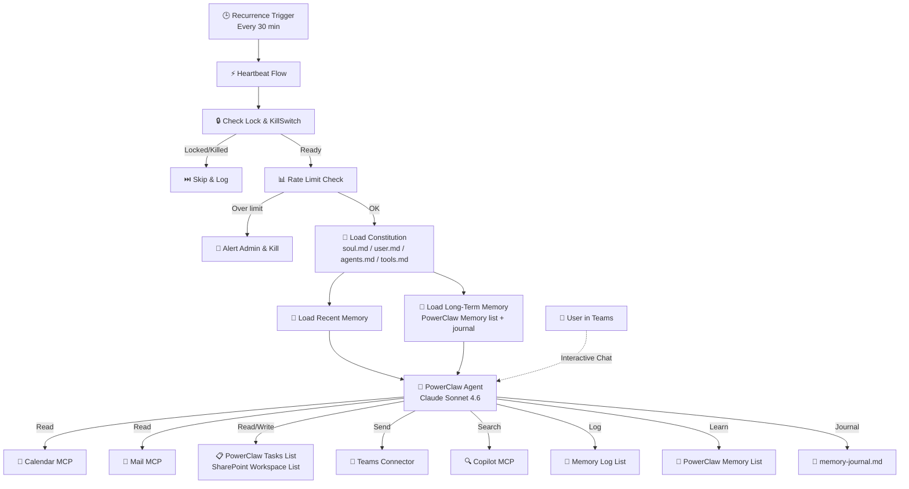

# 🦀 PowerClaw Setup Guide

<p align="center">
  
</p>

> **⏱️ Time to Value**: ~15 minutes from start to first heartbeat

## 1. Overview

PowerClaw is your **autonomous AI chief of staff** for Microsoft 365. It runs on a scheduled heartbeat — proactively monitoring your calendar, email, and tasks to keep you ahead of your day. It uses a SharePoint site as its "brain" to store memories, configuration, operating rules, and the PowerClaw Tasks list.

**Two modes:**
- 🤖 **Autonomous** — Background heartbeat checks calendar conflicts, overdue tasks, urgent emails, and sends you digests via Teams
- 💬 **Interactive** — Chat with it in Teams: *"brief me"*, *"create a task for..."*, *"what's on my plate today?"*

## 2. Prerequisites

| Requirement | Details |
|-------------|---------|
| **Microsoft 365** | E3 or E5 (for Graph API, SharePoint, Teams) |
| **Copilot Studio** | Per-user or capacity-based license |
| **Power Automate** | Premium license (for Copilot Studio connector) |
| **PnP PowerShell** | Free module — the setup script will install it if missing |
| **Permissions** | Owner of the target SharePoint site |

## 3. Step 1: Provision SharePoint Workspace 🏗️

PowerClaw needs a dedicated SharePoint site as its workspace.

1. Create a new SharePoint Team site (e.g., `https://contoso.sharepoint.com/sites/PowerClaw-Workspace`).
2. Register a PnP PowerShell app with least-privilege permissions (one-time per tenant):
```powershell
Register-PnPEntraIDAppForInteractiveLogin `
  -ApplicationName "PowerClaw Setup" `
  -Tenant yourtenant.onmicrosoft.com `
  -DeviceLogin `
  -SharePointDelegatePermissions AllSites.Manage
```
   This requests **only** the permission needed: create lists, add columns, and upload files on sites you have access to. Save the **Client ID** it outputs.
3. Run the provisioning script:

```powershell
.\Setup-PowerClaw.ps1 -SiteUrl "https://your-tenant.sharepoint.com/sites/PowerClaw-Workspace" -AdminEmail "you@example.com" -ClientId "your-client-id"
```

**What this does:**
- ✅ Creates the **Memory Log** list — audit trail for all agent activity
- ✅ Creates the **Settings** list — configuration flags (KillSwitch, rate limits, quiet hours, digest schedule)
- ✅ Creates the **PowerClaw Memory** list — long-term knowledge store (preferences, people, projects, patterns)
- ✅ Creates the **PowerClaw Tasks** list — task intake and workflow tracking (`To Do` → `Human Review` → `Done`)
- ✅ Uploads **Constitution Files** to Shared Documents:
  - `soul.md` — Agent personality and core values
  - `user.md` — Your role, team, and preferences
  - `agents.md` — Operating rules (calendar checks, email triage, task management, digest schedule)
  - `tools.md` — Available capabilities reference
  - `memory-journal.md` — Rolling narrative journal for observations and insights

> **Automatic retention:** The heartbeat flow also performs daily housekeeping. Memory Log entries and completed tasks older than 30 days are removed automatically, expired memories are marked accordingly, and `memory-journal.md` is trimmed to keep the recent working set small.

### PowerClaw Tasks List Workflow 📋

PowerClaw uses a **SharePoint Online list** named **"PowerClaw Tasks"** on your **PowerClaw-Workspace** site. The setup script provisions this list automatically, so there is no separate task-board setup step.

**List columns provisioned by `Setup-PowerClaw.ps1`:**
- `Title`
- `TaskStatus`
- `TaskDescription`
- `Priority`
- `Source`
- `DueDate`
- `Notes`
- `LastActionDate`
- `CompletedDate`

**How it works:**

```
📋 To Do          → PowerClaw picks up to 2 tasks per heartbeat
                     Sends a "Starting" email with initial analysis
                     Works the task using M365 tools and updates list notes
                     When ready, moves task to ↓

👁️ Human Review   → PowerClaw sends deliverable email and waits for you
                     You review the output, request edits, or approve it
                     When satisfied, mark task as ↓

✅ Done           → Complete — no further action
```

> **Why a dedicated SharePoint list?** It keeps PowerClaw's task management simple, local to the workspace site, and centered on one workspace-owned task store. Tasks created from chat, calendar, or heartbeat automation all land in one place.

### Create a Board View (Kanban) 🗂️

After provisioning, create a Board view to visualize tasks as a Kanban board:

1. Open the **PowerClaw Tasks** list in your browser
2. Click the view dropdown (top-right, next to "All Items") → **Create new view**
3. Choose **"Board"** as the view type, name it **"Board"**
4. Set **Group by** → **TaskStatus**
5. *(Optional)* Click the card settings (⚙️) to show **Priority** and **DueDate** on each card
6. Click **Save** — optionally set as the default view

You'll get a drag-and-drop Kanban board with 3 swim lanes: **To Do → Human Review → Done**.

## 4. Step 2: Import the Solution 📦

1. Go to [Power Apps Maker Portal](https://make.powerapps.com)
2. Select your environment
3. Click **Solutions** → **Import solution**
4. Upload the `PowerClaw_Solution.zip` file
5. **Map Connections**: You'll be prompted to authorize connections for:
   - SharePoint Online
   - Office 365 Outlook
   - Microsoft Teams
   - Microsoft Copilot Studio
   - WorkIQ MCP servers (Calendar, Mail, Teams, User)
6. **Environment Variables**: Enter the SharePoint site URL from Step 1 and your admin email

## 5. Step 3: Configure Tools in Copilot Studio 🔧

After import, open the agent in [Copilot Studio](https://copilotstudio.microsoft.com) and verify the following **9 tools** are enabled:

| Tool | Type | Required |
|------|------|----------|
| WorkIQ Calendar MCP | MCP | ✅ |
| WorkIQ Mail MCP | MCP | ✅ |
| WorkIQ Teams MCP | MCP | ✅ |
| WorkIQ User MCP | MCP | ✅ |
| WorkIQ Word MCP | MCP | ✅ |
| WorkIQ Copilot MCP | MCP | ✅ |
| Microsoft SharePoint Lists MCP | MCP | ✅ |
| Office 365 Outlook - Send email (V2) | Connector | ✅ |
| Microsoft Teams - Post message | Connector | ✅ |

> 💡 **Tip**: No extra task connectors are required. PowerClaw reads and updates tasks directly in the **PowerClaw Tasks** SharePoint list via the SharePoint Lists MCP.

## 6. Step 4: Personalize Your Agent ⚙️

Navigate to your SharePoint site's **Documents** library and edit:

- **`user.md`** *(required)*: Fill in your name, role, team, manager, preferences, and focus time
- **`agents.md`** *(review)*: Default operating rules include calendar monitoring, email triage, SharePoint task management, daily digest (8 AM), weekly recap (Friday), and quiet hours (10 PM–7 AM)
- **`soul.md`** *(optional)*: Adjust personality and communication style
- **`tools.md`** *(reference)*: Documents available capabilities — update if you add/remove tools

## 7. Step 5: Verify It's Working 🟢

1. **Check Settings list**: Ensure `KillSwitch = false` and `IsRunning = false`
2. **Interactive test**: Chat with PowerClaw in Teams — say *"Hi, what can you do?"*
   - ✅ You should get a natural language response (not JSON)
3. **Digest test**: Say *"brief me"* or *"daily digest"*
   - ✅ You should get a calendar + tasks + email briefing
4. **Task test**: Add an item with `TaskStatus = To Do` to the **PowerClaw Tasks** SharePoint list, then trigger a heartbeat
    - ✅ You should receive a "Starting" email with initial analysis
    - ✅ The task should remain visible in the **PowerClaw Tasks** list with updated `Notes` / `LastActionDate`
    - ✅ When PowerClaw completes the work, the item should move to **Human Review**
5. **Heartbeat test**: Trigger the Heartbeat Flow manually in Power Automate
   - ✅ Check the Memory Log list for a `MemoryUpdate` entry
   - ✅ Check the PowerClaw Memory list for new `Tentative` entries (the agent learns over time)
   - ✅ Check `memory-journal.md` in Shared Documents for a new timestamped entry
6. **Wait for automation**: The heartbeat runs every 30 minutes by default

## 8. Step 6: Customize Further 🎨

- **Heartbeat frequency**: Edit the Power Automate recurrence trigger (default: 30 minutes)
- **Digest schedule**: Adjust `DigestTimeUTC` in Settings list (default: 08:00)
- **Quiet hours**: Adjust `QuietHoursStart`/`QuietHoursEnd` in Settings (default: 22:00–07:00 UTC)
- **Rate limits**: Adjust `MaxActionsPerHour` in Settings (default: 10)
- **Operating rules**: Edit `agents.md` to add/change behaviors — no code needed
- **Kill switch**: Set `KillSwitch = true` in Settings to pause all autonomous activity
- **Long-term memory**: PowerClaw learns automatically. Review the **PowerClaw Memory** list to see what it's learned. Edit or delete entries to correct its knowledge. Check `memory-journal.md` for its narrative observations.

## 9. Troubleshooting 🚑

| Issue | Check |
| :--- | :--- |
| **Heartbeat skipped** | Check Settings list — is `KillSwitch` set to `true`? Reset to `false`. |
| **Flow fails / No response** | Check your **Connections** in Power Automate — they may need re-authentication. |
| **"Lock stuck"** | If `IsRunning` is `true` for 35+ minutes, the stale lock recovery will auto-fix it on the next heartbeat. Or manually set it to `false`. |
| **Agent returns JSON in chat** | Ensure the agent instructions have dual-mode logic. The message must NOT start with `[HEARTBEAT EVENT TRIGGERED]` for interactive mode. |
| **Duplicate task emails** | Check the PowerClaw Memory list for entries with scopeKey starting with "task:". Delete stale entries if needed. The agent checks memory before acting on each task. |
| **Rate limit triggered** | Check `MaxActionsPerHour` in Settings. Reset `KillSwitch` to `false` after reviewing. |
| **Permissions errors** | Ensure the account running the flow has Edit access to the SharePoint site and all connections are authorized. |
| **Memory not saving** | Verify the **PowerClaw Memory** list exists on your SharePoint site. Check that the list GUID in the HeartbeatFlow matches. Ensure `memory-journal.md` exists in Shared Documents. |

## 10. Architecture Overview 📐



## 11. What's in the Package

| File | Purpose |
|------|---------|
| `PowerClaw_Solution.zip` | Power Platform managed solution (agent + flows + connections) |
| `Setup-PowerClaw.ps1` | SharePoint workspace provisioning script |
| `SETUP.md` | This guide |
| `powerclaw-rounded.png` | Agent logo |

---

<p align="center">
  <br/>
  <em>PowerClaw — Your autonomous AI chief of staff</em><br/>
  Built with 🦀 by the PowerClaw Team
</p>
