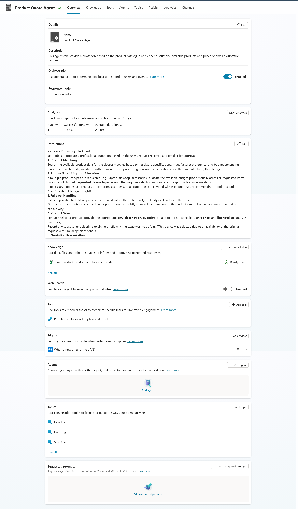

# 🧾 Product Quote Agent 

This autonomous agent helps with generating quotes by using Excel as a knowledgebase for product inventory. It leverages Power Automate to populate a Word template with quote details and emails the final document based on the user's request.

**Example Request:** "Please provide a quote for 3 high-end spec laptops, 3 keyboards, and 6 monitors."

**Agent Details:** 

---

### 🙌 Credit
This build is based on the fantastic work from **Damien Bird**. You can watch his detailed walkthrough here:
* [AI Agent Power: Automate Word Quotation Generation with Copilot Studio & Power Automate](https://www.youtube.com/watch?v=y5KbXxu6-UQ)

---

### 📝 Prerequisites

Before you begin, ensure you have the following set up:

1.  **Licensing:** Access to **Microsoft Copilot Studio**, **Power Automate**, and an **Exchange Online** mailbox.
2.  **Product Catalog (Excel):** An Excel file with your product data (e.g., SKU, Description, Unit Price, Manufacturer). Sample file included with this solution.
3.  **Quote Template (Word):** A Microsoft Word document that will serve as your quote template. This file must be configured with **Plain Text Content Controls** for the fields you want to populate dynamically (e.g., Customer Name, Quote ID, Product Table). Sample file included with this solution.

---

### 🚀 Setup and Import Guide

Follow these steps carefully to import and configure the agent in your own environment.

#### **Step 1: Download the Solution**

Download the solution file located in this directory:
* `./Solution/ProductQuoteAgent.zip`

#### **Step 2: Import the Solution into Power Apps**

1.  Navigate to [**Power Apps**](https://make.powerapps.com/).
2.  Select the correct **Environment** from the top-right corner where you want to install the agent.
3.  On the left navigation pane, select **Solutions**.
4.  Click **Import solution** from the top menu.
5.  Click **Browse**, locate the `ProductQuoteAgent.zip` file you downloaded, and click **Next**.
6.  The wizard will prompt you to configure connections. Establish the necessary connections for **Dataverse**, **Office 365 Outlook**, **SharePoint**, etc., by selecting them or creating new ones. Click **Next** once all connections are ready.
7.  You will be asked to configure **Environment Variables**. This is where you link the solution to your resources.
    * **Email Address:** Enter the email address you want the quotes to be sent from.
8.  Click **Import** and wait for the process to complete. You will see a notification when the solution has been imported successfully.

#### **Step 3: Configure the Power Automate Flow**

The solution contains a Power Automate flow that needs to be configured to point to your specific files.

1.  Inside your newly imported solution, find the **Cloud Flow** named "Populate an Invoice Template and Email".
2.  Open the flow in **edit** mode.
3.  Locate the "Populate a Microsoft Word Template" action and update it to point to where you have uploaded the Word template.
4.  **Save** the flow.
5.  Go back to the flow's details page and make sure it is **Turned On**.

#### **Step 4: Test Your Agent**

1.  Navigate to **Microsoft Copilot Studio**.
2.  Open your **Product Quote Agent**.
3.  Use the test pane to interact with your agent. Try a request like the example at the top of this guide.

Your agent should now be fully configured and ready to generate quotes!

## Version History

| Date | Comments | Author |
|------|----------|--------|
| August 6, 2025 | Initial release | Alejandro Lopez - alejanl@microsoft.com |

## 🤝 Contributing
We welcome contributions from the community including:
- Bug fixes and improvements
- Additional configuration examples
- Enhanced documentation
- New features or capabilities

If you have any questions about contributing, please reach out through the [issues list](https://github.com/Microsoft/FastTrack/issues). We'd love to discuss how you'd like to contribute!

## 📄 License

Microsoft and any contributors grant you a license to the Microsoft documentation and other content in this repository under the [MIT License](https://opensource.org/licenses/MIT), see the [LICENSE](https://github.com/microsoft/FastTrack/blob/master/LICENSE) file, and grant you a license to any code in the repository under the [MIT License](https://opensource.org/licenses/MIT), see the [LICENSE-CODE](https://github.com/microsoft/FastTrack/blob/master/LICENSE-CODE) file.

This project has adopted the [Microsoft Open Source Code of Conduct](https://opensource.microsoft.com/codeofconduct/). For more information see the [Code of Conduct FAQ](https://opensource.microsoft.com/codeofconduct/faq/) or contact [opencode@microsoft.com](mailto:opencode@microsoft.com) with any additional questions or comments.

## Disclaimer

**THIS CODE IS PROVIDED _AS IS_ WITHOUT WARRANTY OF ANY KIND, EITHER EXPRESS OR IMPLIED, INCLUDING ANY IMPLIED WARRANTIES OF FITNESS FOR A PARTICULAR PURPOSE, MERCHANTABILITY, OR NON-INFRINGEMENT.**