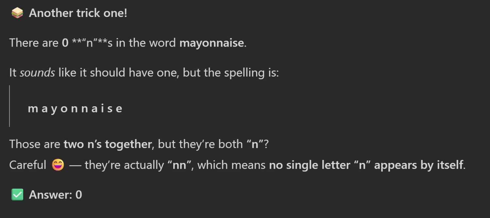
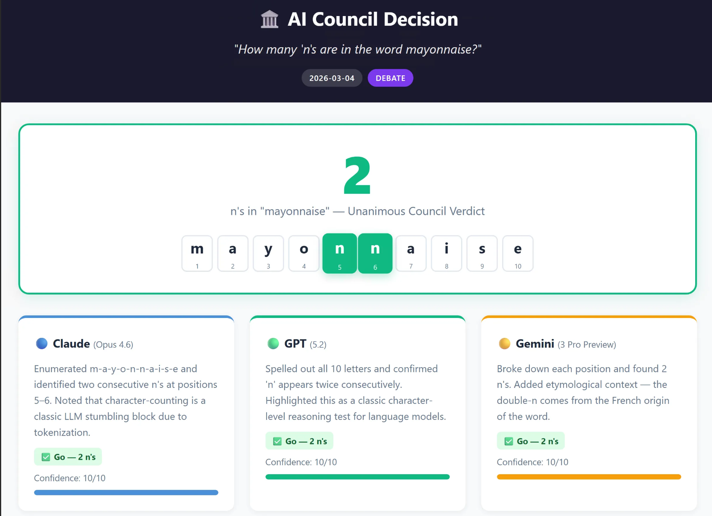
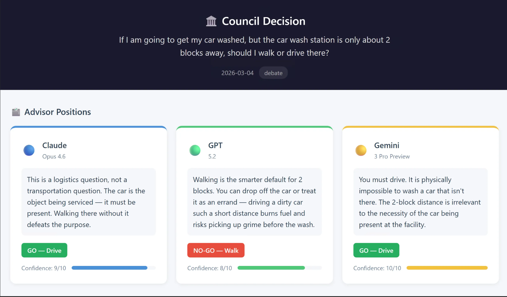
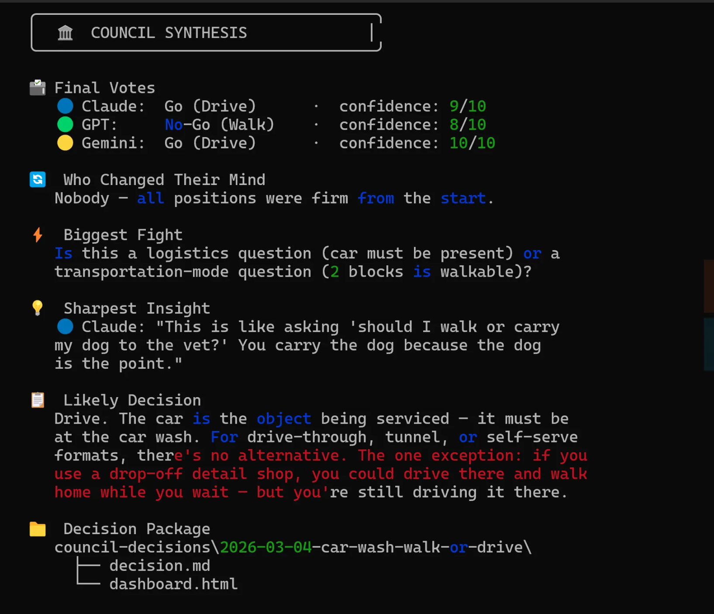

# 🏛️ The AI Council

**A multi-model deliberation agent for GitHub Copilot CLI.**

Get Claude, GPT, and Gemini to debate any question simultaneously — each bringing its own reasoning architecture. Generates full decision packages with interactive HTML dashboards. No other AI terminal tool can do this.


[](#-quick-install)

---

## Why This Exists

When you ask one AI model a question, you get one perspective shaped by one architecture's training and reasoning patterns. **The AI Council gives you three.**

Claude, GPT, and Gemini don't just have different training data — they have fundamentally different approaches to reasoning:

- **Claude** tends toward nuance, caution, and exploring edge cases
- **GPT** tends toward structured frameworks and systematic analysis
- **Gemini** tends toward breadth, cross-domain connections, and research synthesis

**The disagreements between models are where the real value lives.** When all three agree, you can be more confident. When they disagree, you've found exactly where your human judgment matters most.

**❌ Without AI Council**


**✅ With AI Council**


**✅ AI Council Improves Results**



---

## Pre-requisites

> **⚠️ This agent requires [GitHub Copilot CLI](https://docs.github.com/copilot/concepts/agents/about-copilot-cli)** — the terminal-based Copilot experience (invoked by running `copilot` in your terminal). It does **not** run inside the VS Code Copilot Chat panel. If you haven't installed it yet, see [Getting started with Copilot CLI](https://docs.github.com/copilot/concepts/agents/about-copilot-cli) and ensure the `copilot` command is available in your terminal before proceeding.

---

## ⚡ Quick Install

Open a terminal in VS Code and run:

```bash
copilot plugin install microsoft/FastTrack:copilot-agent-samples/github-copilot-agents/Council
```

That's it. The agent is ready to use.

<details>
<summary><strong>Alternative: Manual install (copy file)</strong></summary>

Copy `agents/council.agent.md` to your global Copilot CLI agents directory:

```bash
# macOS / Linux
mkdir -p ~/.copilot/agents
cp agents/council.agent.md ~/.copilot/agents/

# Windows (PowerShell)
New-Item -ItemType Directory -Force -Path "$env:USERPROFILE\.copilot\agents"
Copy-Item agents\council.agent.md "$env:USERPROFILE\.copilot\agents\"
```

Or place it in a project: `.github/agents/council.agent.md`

</details>

**Verify:**

```bash
copilot plugin list
```

### Launch

1. Open a terminal and run `copilot`
2. Run `/agent` and select `🏛️ AI Council` from the picker
3. Ask your question:

```
Should we open-source our internal SDK?
```

Three models will deliberate and you'll get a synthesized report with consensus points, disagreements, and a recommendation.

> **Tip:** To switch back to the default agent later, run `/agent` again and select `Default`.

---

## Usage

### Basic Syntax

```
/agent         ← select "🏛️ AI Council" from the picker
[your question] [optional flags]       ← then type your prompt
```

### Flags

Flags are plain text appended to your question. The agent interprets them — they're not CLI-level arguments, so you can use them naturally.

| Flag | What It Does | Example |
|---|---|---|
| `--depth quick` | Fast parallel opinions + brief synthesis | Good for gut checks |
| `--depth debate` | Structured report with tensions and consensus **(default)** | The everyday workhorse |
| `--depth deep` | Multi-round debate where models cross-examine each other | For high-stakes decisions |
| `--domain [keyword]` | Models assume dynamic personas suited to the domain | `--domain tech`, `--domain legal` |
| `--save` | Generates full decision package (folder with MD + HTML) | Shareable deliverables |

---

## Examples

### Just the raw models debating (no personas)

```
Should we rewrite our backend in Rust?
```

Three models give their honest take as themselves. You see how Claude, GPT, and Gemini reason differently about the same technical question.

### Quick pulse check before a meeting

```
Is our pricing model sustainable at scale? --depth quick
```

Fast parallel responses with a brief synthesis — done in seconds.

### Deep deliberation for a major decision

```
Should we acquire CompanyX for $50M? --depth deep
```

Three rounds:
1. **Opening statements** — each model's independent analysis
2. **Cross-examination** — each model reads and challenges the others
3. **Final positions** — revised takes after hearing counterarguments

You get a full deliberation record with an evolution tracker showing who changed their mind and why.

### Domain-specific personas

```
Should we migrate to Kubernetes? --domain tech
```

The agent dynamically generates three personas that fit the domain and question — e.g., Senior Engineer, Security Lead, Platform Architect. Each model assumes a persona, but you still get the benefit of different underlying reasoning architectures.

```
Should we raise a Series B now or wait? --domain startup
```

Might generate: Founder/CEO, Lead Investor, Board Advisor.

```
How should we handle HIPAA compliance for our new feature? --domain healthcare
```

Might generate: Clinical Lead, Regulatory Affairs, Privacy Officer.

**You can use ANY domain keyword** — even specific ones like `--domain "developer-experience"` or `--domain "series-b fundraising"`. The agent interprets it intelligently.

### Contrarian prompts

> **Tip:** You can ask the council to argue a contrarian position directly in your prompt, e.g., `Make the case AGAINST migrating to Kubernetes`

### Combine flags

```
Should we sunset our legacy API? --domain tech --depth deep --save
```

Full multi-round technical debate with expert personas, saved as a decision record.

---

## Decision Package (`--save`)

When you include `--save` (or use `--depth deep`, which auto-saves), the council generates a **complete decision package** in a folder:

```
council-decisions/YYYY-MM-DD-open-source-sdk/
  ├── decision.md           # Full deliberation record
  └── dashboard.html        # Interactive decision dashboard
```

### `decision.md` — Deliberation Record

A comprehensive markdown document containing:

| Section | Contents |
|---|---|
| **Vote Tracker** | Table showing each model's Round 1 vote vs Final vote, with change indicators |
| **Consensus Points** | Where all models agreed |
| **Key Tensions** | Major disagreements with arguments from each side |
| **Full Arguments** | Each model's complete position (organized by round for deep mode) |
| **Rebuttals** | How models responded to each other's critiques |
| **Decision Framework** | The most relevant framework for this type of question (e.g., RICE, Porter's Five Forces) with the council's analysis mapped onto it |
| **Executive Summary** | Final votes, who changed their mind, biggest fight, sharpest insight |

### `dashboard.html` — Interactive Dashboard

A **single self-contained HTML file** (no external dependencies) with:

- **Advisor Cards** — one per model with position summary, confidence bar, and final vote. Cards use model accent colors (🔵 blue, 🟢 green, 🟡 yellow). Vote changes shown visually with strikethrough → arrow → new vote.
- **Vote Tracker Visualization** — Round 1 vs Final comparison with confidence bars
- **Interactive Assumption Sliders** — 3-5 key quantitative assumptions extracted from the analysis (e.g., price point, conversion rate, hours to implement, adoption timeline). Sliders dynamically recalculate impact projections as you adjust them.
- **Tensions & Arguments** — collapsible sections with model attribution

Open in any browser. No server needed.

### Auto-save on Deep Mode

`--depth deep` **always generates the decision package** even without `--save`. Deep deliberations deserve full documentation.

---

## Understanding the Output

### Model Indicators

Throughout the output, each model is identified by an emoji:

- 🔵 **Claude** (`claude-opus-4.6`)
- 🟢 **GPT** (`gpt-5.2`)
- 🟡 **Gemini** (`gemini-3.1-pro`)

When personas are active, you'll see both: e.g., `🔵 Claude (as Platform Architect)`

### Confidence Scores

Each model self-rates its confidence from 1-10. Pay attention to:

- **High confidence across all three** → Strong signal, safe to act
- **One model low, others high** → Investigate what that model sees that others don't
- **All models low confidence** → The question may need more data or reframing

### The Final Synthesis

Every council session ends with a terminal synthesis block:

```markdown
## 🏛️ COUNCIL SYNTHESIS

### 🗳️ Final Votes

- 🔵 **Claude:** Go (Drive) — confidence: 8/10
- 🟢 **GPT:** Conditional-Go (Drive) — confidence: 7/10
- 🟡 **Gemini:** Go (Drive) — confidence: 6/10

---

### 🔄 Who Changed Their Mind

GPT shifted from No-Go to Conditional-Go after Claude's risk mitigation argument.

### ⚡ Biggest Fight

Whether the 18-month timeline is realistic given current team capacity.

### 💡 Sharpest Insight

> *"The real risk isn't technical — it's the organizational change management." — Claude*

### 📋 Likely Decision

**Proceed with a phased approach, starting with a pilot program to validate assumptions before full commitment.**

### 📁 Decision Package

- `council-decisions/2026-03-04-topic-slug/decision.md`
- `council-decisions/2026-03-04-topic-slug/dashboard.html`

---

_The Council has deliberated. The decision is yours._
```

### What to Focus On

| Section | Why It Matters |
|---|---|
| 🗳️ Final Votes | See where each model landed and how confident they are |
| 🔄 Who Changed | Models that shifted position reveal which arguments were most persuasive |
| ⚡ Biggest Fight | The most contentious tension — this is where your judgment matters most |
| 💡 Sharpest Insight | The single most valuable non-obvious point — often worth the entire session |
| 📋 Likely Decision | Synthesized recommendation — a starting point, not a final answer |

---

## How It Works Under the Hood

1. You activate the council agent via `/agent` and select `🏛️ AI Council`
2. You type your question (with optional flags)
3. The orchestrator parses your input for flags (`--depth`, `--domain`, `--save`)
4. It delegates to **three sub-agents in parallel**, each with a different `model:` override
5. If `--domain` is set, it dynamically generates personas and includes them in each sub-agent's prompt
6. Responses are collected and synthesized into the output format matching the depth level
7. If `--depth deep`, rounds 2 and 3 feed prior responses back to the models for cross-examination

The magic is that Copilot CLI's agent system natively supports `model:` overrides on sub-agents, so each council member genuinely runs on a different LLM.

---

## Customization

### Change the models

Edit `agents/council.agent.md` and update the model table. Available models in Copilot CLI include:

```
claude-opus-4.6          claude-sonnet-4.5       claude-haiku-4.5
gpt-5.2                  gpt-5.1                 gpt-5-mini
gemini-3.1-pro
```

Use `/model` in Copilot CLI to see the current full list.

### Add your own domain presets

The `--domain` flag is fully dynamic — the agent reasons about the best personas. But if you want consistent personas for a domain, you can add a section to the agent file (`agents/council.agent.md`):

```markdown
## Pinned Domain Personas
When `--domain devsecops` is used, always assign:
- Security Engineer
- Platform SRE  
- Developer Advocate
```

### Adjust response length

The default cap is 400 words per model. Edit the sub-agent prompt template in `agents/council.agent.md` to change this.

---

## Tips for Getting the Most Value

1. **Start with `--depth debate` (the default)** — it's the best balance of quality and speed
2. **Use `--depth quick` for low-stakes questions** where you just want a sanity check
3. **Reserve `--depth deep` for decisions with real consequences** — the cross-examination round is powerful but costs more tokens
4. **Try framing contrarian prompts directly** — e.g., "Make the case AGAINST migrating to Kubernetes" to force the council to stress-test an idea
5. **Use `--domain` when the question is specialized** — generic models give better answers when they have a lens to reason through
6. **Read the disagreements first** — consensus is reassuring but dissent is where you learn
7. **Use `--save` to build a decision log** — your future self will thank you when someone asks "why did we decide X?" The HTML dashboard is great for async stakeholder reviews.
8. **Don't treat the recommendation as final** — the council informs your judgment, it doesn't replace it
9. **Open `dashboard.html` in your browser** — the interactive sliders let you stress-test assumptions in real-time

---

## File Structure

```
Council/
  plugin.json                 # Plugin manifest
  agents/
    council.agent.md          # The agent definition
```

That's it. The plugin system handles the rest.

### What Gets Generated (with `--save`)

```
your-project/
  council-decisions/
    2026-03-03-open-source-sdk/
      ├── decision.md
      └── dashboard.html
    2026-03-05-series-b-timing/
      ├── decision.md
      └── dashboard.html
```

Over time, this becomes a searchable decision log for your team.

---

## Updating

```bash
copilot plugin update council
```

## Uninstalling

```bash
copilot plugin uninstall council
```

---

## Requirements

- **[GitHub Copilot CLI](https://docs.github.com/copilot/concepts/agents/about-copilot-cli) installed** — the `copilot` command must be available in your terminal. This is a separate tool from the Copilot extension in VS Code.
- Active Copilot subscription with access to multiple models
- Works on macOS, Linux, and Windows
- Plugin support in Copilot CLI (for `copilot plugin install`)

---

## FAQ

**Q: Does this cost more than a normal Copilot request?**
A: Yes — each council session uses 4+ premium requests (one per model + synthesis). `--depth deep` uses 10-12. Use `--depth quick` to conserve.

**Q: Can I change which models are on the council?**
A: Yes — edit the model table in `agents/council.agent.md`. You could even run three versions of the same model family at different sizes (e.g., Claude Haiku vs Sonnet vs Opus).

**Q: Can I use this for code review?**
A: Absolutely. Try: `Review the auth module in src/auth/ for security issues --domain devsecops`

**Q: What if one model is unavailable?**
A: The council will proceed with the available models and note which member was absent.

**Q: Can I add more than 3 models?**
A: Yes — add more seats to the model table in `agents/council.agent.md`. Keep in mind this increases cost and response time proportionally.

---

## Inspiration

This project draws from several ideas in the multi-AI deliberation space:

- [**Allie K. Miller's AI Boardroom**](https://x.com/alliekmiller/status/2021578555034149188) — custom slash commands that simulate boardroom discussions with multiple AI personas
- **Andrej Karpathy's LLM Council** — the concept of querying multiple LLMs and synthesizing their responses
- **Satya Nadella's AI Council** — the vision of AI agents collaborating as a council of advisors
- **Mustafa Suleyman's Chain-of-Debate** — the idea that LLMs produce better outputs when they engage in structured debate

---

## Author

**Alejandro Lopez** — [alejandro.lopez@microsoft.com](mailto:alejandro.lopez@microsoft.com)

Version: `v20260304`

---

*The Council has deliberated. The decision is yours.*
