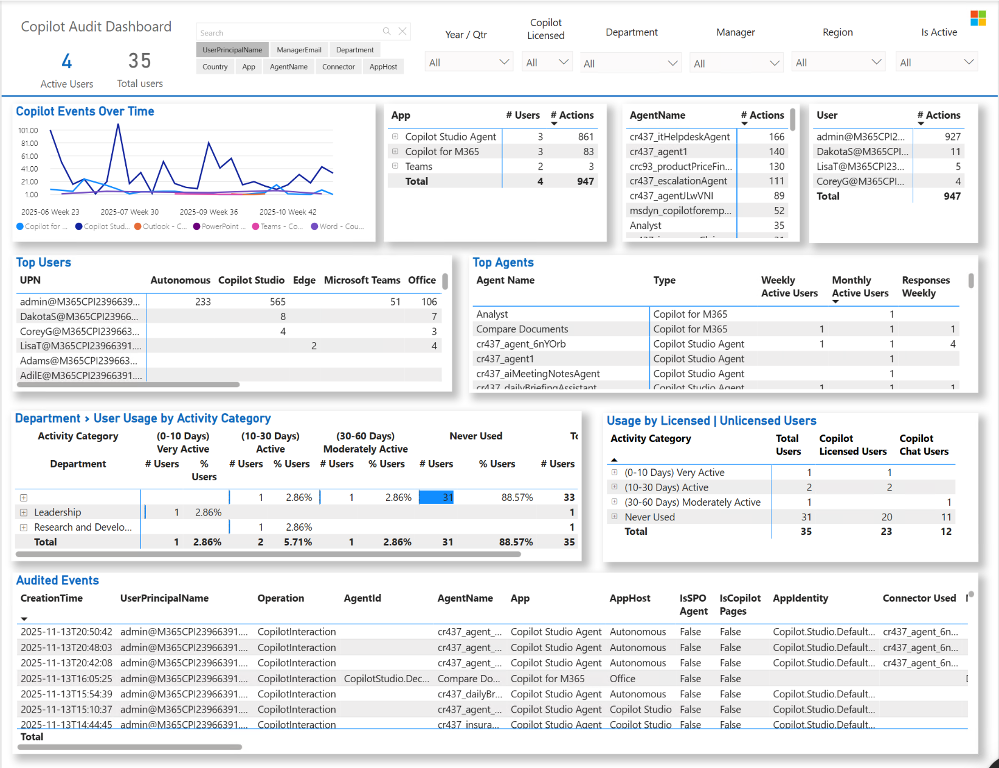
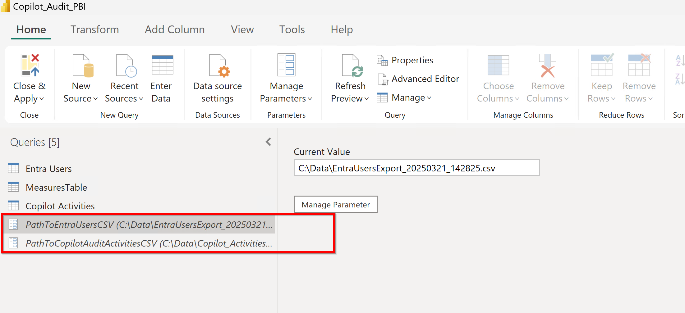

# 🔍 Copilot Audit Dashboard

> [!IMPORTANT]
> **New & Improved Data Workflow\!** This guide has been updated to use the Microsoft Purview UI for exporting audit logs. This method is more reliable and complete, especially for large organizations. Latest version includes Copilot interactions including Copilot Studio lite & Copilot Studio full agent events. 

## 📊 Overview

This solution provides a comprehensive Power BI dashboard for analyzing Microsoft 365 Copilot audit events. By combining data from Microsoft Purview and Microsoft Entra ID, you can gain deep insights into usage patterns, user adoption, and organizational impact.



> [!WARNING]
> **Disclaimer**: This tool uses Microsoft Purview audit logs, which are intended for security and compliance, not as an official source for Copilot usage reporting. Metrics may differ from official reports in the M365 Admin Center or Viva Insights. Use the data to identify broad trends, not for precise measurement. You are solely responsible for legal and data privacy compliance. Microsoft disclaims all liability related to your use of this tool.

## ✅ How It Works

This solution uses a simple, two-step data export process followed by a Power BI template for visualization.

1.  **Purview Audit Log Export (UI)**: You will export all **"CopilotInteraction"** events directly from the Microsoft Purview compliance portal. This is the primary source of usage data.
2.  **Entra User Export (PowerShell)**: A simple PowerShell script is used to export user details (like department and manager) to add organizational context to the report.

These two CSV files are then loaded into the Power BI template.

## 🚀 Getting Started (3 Simple Steps)

### Step 1: Export Copilot Audit Logs from Purview 🖥️

First, you'll export the Copilot interaction data. Using the Purview UI is the most reliable way to get a complete dataset.

1.  Navigate to the **[Microsoft Purview portal](https://purview.microsoft.com/)**.
2.  In the left navigation pane, click **Audit**.
3.  On the **Search** tab, configure the following:
      * **Date and time range**: Select the time period you want to analyze (e.g., Last 30 days).
      * **Record Types**: In the search box, type and select **`CopilotInteraction`**.
      * **Users**: Leave this blank to search for all users.
4.  Click the **Search** button. The search may take some time to complete.
5.  Once the results are displayed, click **Export** \> **Download all results**.
6.  The export process will prepare a CSV file for you. You can check the status in the **Export** tab and download the file once it's ready. Save this CSV file to a known location on your computer.

> For more detailed guidance on searching the audit log, see the official documentation: [**Get started with audit search**](https://learn.microsoft.com/en-us/purview/audit-search#get-started-with-search).

-----

### Step 2: Export Entra User Details with PowerShell 👥

Next, you'll run a PowerShell script to get organizational data for your users.

1.  Download the `Export-M365CopilotReports.ps1` script file.
2.  Open PowerShell and navigate to the script's location.
3.  Run the script:
    ```powershell
    .\Export-M365CopilotReports.ps1
    ```
4.  From the menu that appears, select the option to **Export Entra Users Details**.
      
5.  This will generate a CSV file with user information like department, manager, and license details. Save this file to the same location as your audit log export.

> **Note**: The script will check if you have the required PowerShell modules (`Microsoft.Graph`, `ExchangeOnlineManagement`) and offer to install them if they are missing.

-----

### Step 3: Configure the Power BI Dashboard 🎨

Finally, connect your exported data to the Power BI report.

1.  Open the Power BI template file (`.pbix`).

2.  In the **Home** ribbon, click **Transform Data**. This will open the Power Query Editor.

3.  In the Power Query Editor, you will see prompts to update the file paths. Update the parameters to point to the two CSV files you just exported:

      * **`PathToCopilotAuditActivitiesCSV`**: The audit log file from Purview.
      * **`PathToEntraUsersCSV`**: The user details file from the PowerShell script.

         

4.  Click **Close & Apply**. Power BI will now load your organization's data into the dashboard.  

-----

## Alternative Method: Use Search-UnifiedAuditLog for Audit Logs

For smaller tenants or for automation purposes, you can still use PowerShell to export the audit logs. However, please be aware of its limitations.

> [!WARNING]
> **Disclaimer**: The `Search-UnifiedAuditLog` PowerShell cmdlet may experience timeouts or return incomplete data in large organizations with a high volume of audit activity. For this reason, the **Purview UI export is the recommended method**.

If you choose to use this method, run the `Export-M365CopilotReports.ps1` script and select the **Export Purview Audit Logs** option. The corresponding PowerBI (.pbix) file is in folder: [Alternate Method](./AlternateMethod/) 

-----

## 🧩 Prerequisites

  * **Admin Permissions**: Required for searching the Purview audit log and running the Microsoft Graph PowerShell script.
  * **PowerShell 5.1+**: Required for the Entra user export script.
  * **Power BI Desktop**: Required to open and view the `.pbix` template file.

-----

## 📚 Additional Resources

  * [Microsoft 365 Copilot Documentation](https://learn.microsoft.com/en-us/microsoft-365-copilot/)
  * [Microsoft Purview Audit Logging](https://learn.microsoft.com/en-us/purview/audit-log-search)
  * [Microsoft Graph API Documentation](https://learn.microsoft.com/en-us/graph/api/overview)

-----

## ❓ Issues & Support

Please report any issues you find to the [issues list](../../../../issues). This is an open-source community solution, and support is not available through official Microsoft channels.

## ⚖️ Legal Notices

This project is provided as-is under the [MIT License](https://www.google.com/search?q=LICENSE). Microsoft and any contributors reserve all other rights.

## 👨‍💻 Publish Details

| Publisher | Original Publish Date | Latest Publish Date |
| :--- | :--- | :--- |
| Alejandro Lopez (alejandro.lopez@microsoft.com) | March 26th, 2025 | October 14th, 2025 |

## ✨ Inspiration
This solution builds on top of the great work from Bojan: [M365 Copilot Audit PowerBI Report](https://github.com/BojanBuhac/M365-Copilot-Audit-Report). The original report provided a foundation that has been expanded with additional features and visualizations.

## ❓ Issues

Please report any issues you find to the [issues list](../../../../issues).

## ⚖️ Support Statement

The scripts, samples, and tools made available through the FastTrack Open Source initiative are provided as-is. These resources are developed in partnership with the community and do not represent official Microsoft software. As such, support is not available through premier or other Microsoft support channels. If you find an issue or have questions please reach out through the issues list and we'll do our best to assist, however there is no associated SLA.

## 🤝 Code of Conduct

This project has adopted the [Microsoft Open Source Code of Conduct](https://opensource.microsoft.com/codeofconduct/).
For more information see the [Code of Conduct FAQ](https://opensource.microsoft.com/codeofconduct/faq/) or
contact [opencode@microsoft.com](mailto:opencode@microsoft.com) with any additional questions or comments.

## 📜 Legal Notices

Microsoft and any contributors grant you a license to the Microsoft documentation and other content in this repository under the [MIT License](https://opensource.org/licenses/MIT), see the [LICENSE](LICENSE) file, and grant you a license to any code in the repository under the [MIT License](https://opensource.org/licenses/MIT), see the [LICENSE-CODE](LICENSE-CODE) file.

Microsoft, Windows, Microsoft Azure and/or other Microsoft products and services referenced in the documentation may be either trademarks or registered trademarks of Microsoft in the United States and/or other countries. The licenses for this project do not grant you rights to use any Microsoft names, logos, or trademarks. Microsoft's general trademark guidelines can be found at http://go.microsoft.com/fwlink/?LinkID=254653.

Privacy information can be found at https://privacy.microsoft.com/en-us/

Microsoft and any contributors reserve all others rights, whether under their respective copyrights, patents,or trademarks, whether by implication, estoppel or otherwise.
