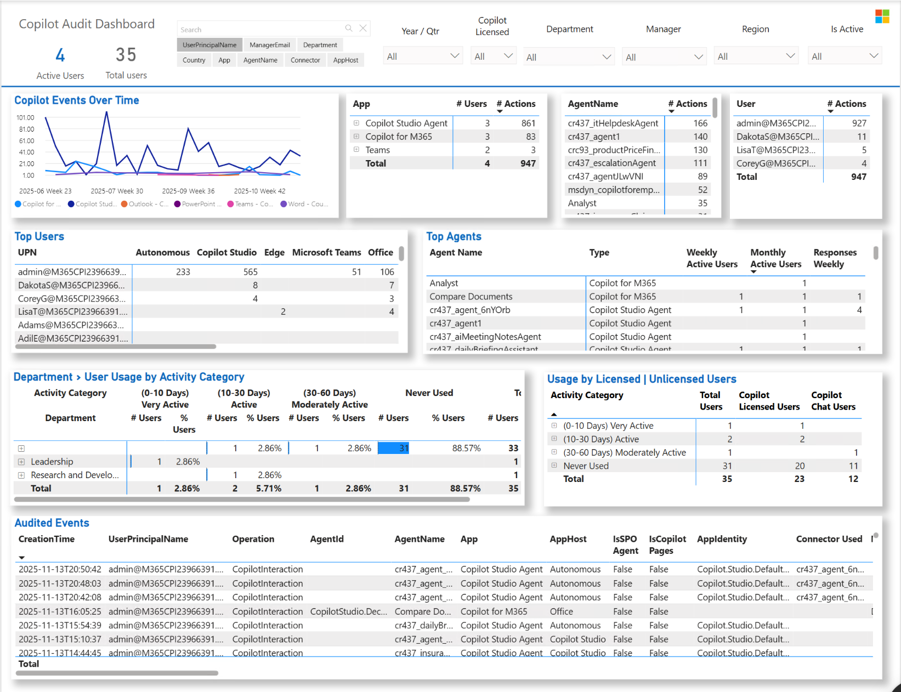
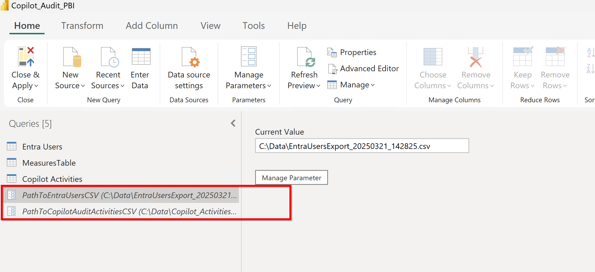

# 🔍 Copilot Audit Dashboard

> [!IMPORTANT]
> **New version (April 21, 2026).** More accurate app & agent classification — Microsoft pre-built agents (Word Drafting Agent, Researcher, Analyst, etc.) no longer inflate host-app counts, and third-party agents are cleanly separated from first-party Copilot Chat. Agent name and ID now populate for autonomous agents. See the [Changelog](#-changelog) for details.

## 📊 Overview

A Power BI dashboard for analyzing Microsoft 365 Copilot usage and adoption across your organization. Combines Microsoft Purview audit data with Entra user details to surface:

- **Who's using Copilot** — by department, role, license type
- **Where they're using it** — Word, Excel, Outlook, Teams, Copilot Chat, agents
- **How usage is trending** — over time, by team, by app

> [!WARNING]
> Microsoft Purview audit logs are intended for security and compliance — not as an official source for Copilot usage reporting. Metrics may differ from the M365 Admin Center or Viva Insights. Use this dashboard to identify **trends and adoption patterns**, not for precise measurement.

## 🚀 Getting Started (3 Steps)

### Step 1: Export Copilot Audit Logs from Purview

1. Go to the **[Microsoft Purview portal](https://purview.microsoft.com/)** → **Audit**.
2. On the **Search** tab:
   - **Date range**: choose your period (e.g., Last 30 days)
   - **Record Types**: select **`CopilotInteraction`**
   - Leave **Users** blank
3. Click **Search**, then **Export** → **Download all results** when ready.
4. Save the CSV.

> See [Get started with audit search](https://learn.microsoft.com/en-us/purview/audit-search#get-started-with-search) for more detail.

### Step 2: Export Entra User Details

1. Download `Export-M365CopilotReports.ps1`.
2. Run it in PowerShell and choose **Export Entra Users Details**.
   
3. The script checks for required modules (`Microsoft.Graph`, `ExchangeOnlineManagement`) and offers to install them if missing.

### Step 3: Load into Power BI

1. Open the `.pbix` file.
2. **Home** → **Transform Data**. Update the two parameters:
   - `PathToCopilotAuditActivitiesCSV` — your Purview export
   - `PathToEntraUsersCSV` — your Entra export
   
3. **Close & Apply**.

<b>Alternative: use <code>Search-UnifiedAuditLog</code> instead of the Purview UI</b>

For smaller tenants or automated pipelines you can export audit logs via PowerShell. Run `Export-M365CopilotReports.ps1` and choose **Export Purview Audit Logs**; the matching `.pbix` lives in [AlternateMethod](./AlternateMethod/).

> [!WARNING]
> `Search-UnifiedAuditLog` can time out or return incomplete data on high-volume tenants. The Purview UI export is the recommended path.

## 📋 How Usage Is Categorized

The dashboard groups every Copilot event into a clear **AppCategory** so leaders can see adoption at a glance:

| Category | What it represents |
| :--- | :--- |
| **Copilot Chat** | Copilot Chat / BizChat across all entry points (Office.com, M365 App, Bing, Edge, browser) |
| **Word / Excel / PowerPoint / Outlook / OneNote / Teams** | Direct Copilot usage inside that app |
| **SharePoint & OneDrive** | Copilot activity tied to content surfaces |
| **Other M365 Apps** | Loop, Whiteboard, Forms, Planner, Stream, Designer, Bookings, Power BI |
| **Viva** | Viva Engage, Viva Copilot, Viva Goals, Viva Pulse |
| **Admin & Security** | Copilot in Purview, Defender, Intune, Azure, M365 / Teams Admin centers, Security Copilot |
| **Microsoft Agents** | Microsoft pre-built agents (Word Drafting Agent, Researcher, Analyst, etc.) |
| **3P Agents** | Third-party / ISV-built Copilot extensions (e.g., Jira Cloud) |
| **Copilot Studio** | User-built Copilot Studio agents |

<b>Why Microsoft agents are separated from host apps</b>

When someone uses **Word Drafting Agent** inside Word, Purview records it with `AppHost = "Word"`. Earlier versions of this dashboard counted that as Word usage — inflating the Word bucket and hiding agent adoption. The current version routes these to **Microsoft Agents** so leaders can see agent adoption distinctly from direct in-app Copilot usage.

<b>A note on Purview audit row counts</b>

Purview `CopilotInteraction` exports are close to one row per prompt in most tenants, but retries, agent hops, and schema changes can cause minor inflation. If you need precise prompt-level counts (vs raw audit row counts), consider a deduplication measure on **User + ThreadId + CreationTime**.

## 🧩 Prerequisites

- **Admin Permissions** — to search the Purview audit log and run the Graph PowerShell script
- **PowerShell 5.1+** — for the Entra user export
- **Power BI Desktop** — to open the `.pbix`

## 📚 Additional Resources

- [Microsoft 365 Copilot documentation](https://learn.microsoft.com/en-us/microsoft-365-copilot/)
- [Microsoft Purview audit logging](https://learn.microsoft.com/en-us/purview/audit-log-search)
- [Microsoft Graph API](https://learn.microsoft.com/en-us/graph/api/overview)

## ❓ Issues & Support

Please report issues to the [issues list](../../../../issues). This is an open-source community solution; support is not available through official Microsoft channels.

## 👨‍💻 Publish Details

| Publisher | Original Publish Date | Latest Publish Date |
| :--- | :--- | :--- |
| Alejandro Lopez (alejandro.lopez@microsoft.com) | March 26th, 2025 | April 21st, 2026 |

## 📝 Changelog

### April 21, 2026
- **Agent name & ID for autonomous agents.** Autonomous (Copilot Studio) agents now show their name and ID parsed from AppIdentity, with a 3-tier fallback (AgentName → AppIdentity → ConnectorUsage).
- **Fixed blank-row detection bug.** `HasCopilotEventDataRecord` now correctly reads from the parsed AuditData record, preventing valid rows from being silently dropped.

### April 20, 2026
- **More accurate agent classification.** Microsoft pre-built agents (Word Drafting Agent, Researcher, Analyst, Outlook Coaching, etc.) now route to a dedicated **Microsoft Agents** category instead of counting toward their host app (Word, Outlook, etc.).
- **Third-party agents separated.** ISV-built Copilot extensions (e.g., Jira Cloud) now have their own **3P Agents** category, cleanly distinct from Microsoft agents and user-built Copilot Studio agents.
- **Cleaner Copilot Chat bucket.** All Copilot Chat entry points (BizChat, Office.com, M365 App, Bing, Edge, and non-first-party callers) now roll up into one **Copilot Chat** category.
- **Expanded AppCategory coverage** — Viva, Admin & Security, Other M365 Apps, SharePoint & OneDrive buckets added for broader visibility.
- **License visibility** — surfaces license type (e.g., Premium) where Purview includes it.

### April 3, 2026
- Comprehensive AppHost mapping with case-insensitive, future-proof fallback.
- Added grouped **AppCategory** column for clean executive dashboards.
- Support for Copilot Studio lite and full-agent events.

### March 26, 2025
- Initial release (Purview UI export + Entra user enrichment).
