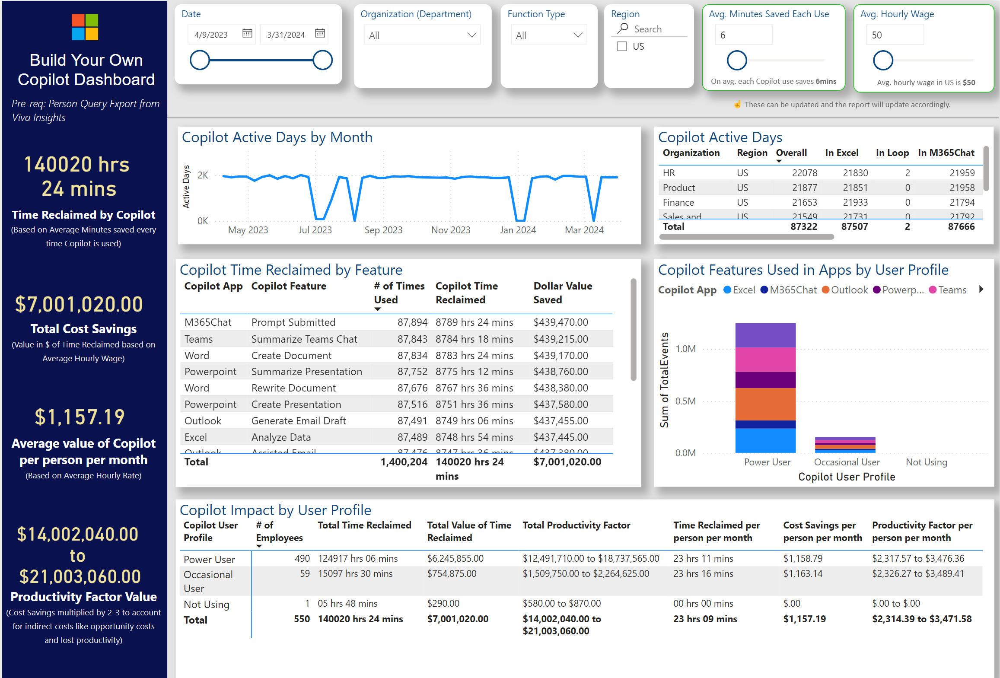
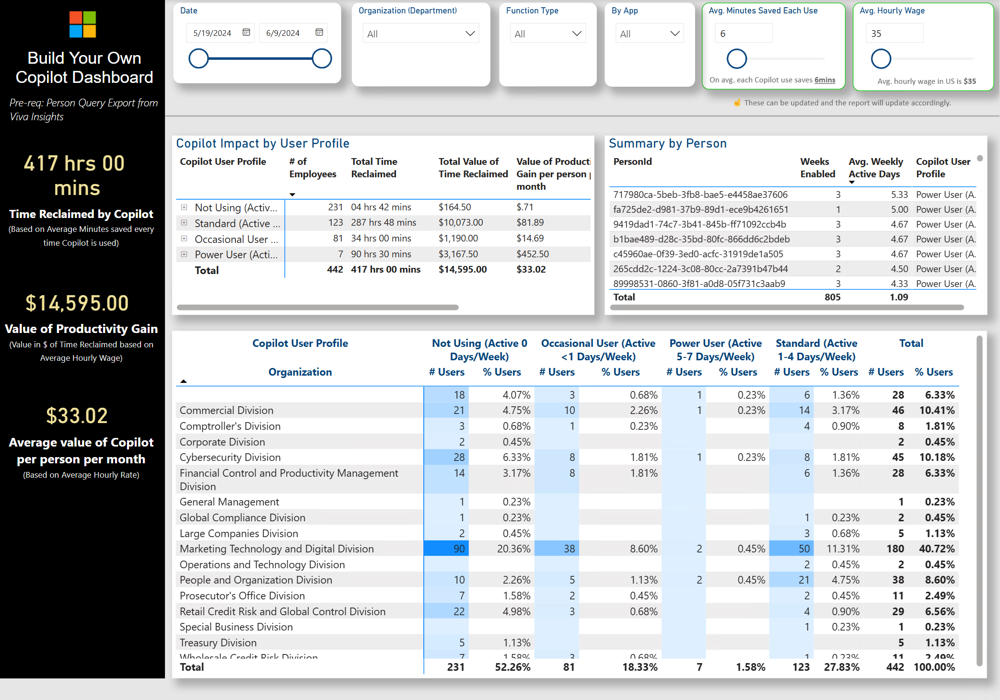

# Build your Own Copilot Dashboard - Sample

## Summary

This is a PowerBI file (.pbix) showing a sample of how the Viva Advanced Insights Person Query export can be visualized in PowerBI. Please review the Word document for steps on how to use.

### Dashboard in BYO-CopilotDashboard.pbix

### Dashboard in BYO-CopilotDashboard - Dynamic Personas.pbix

## Prerequisites

> Microsoft Viva - Advanced Insights

## Solution

| Solution    | Author(s)                                               |
| ----------- | ------------------------------------------------------- |
| Build your Own Copilot Dashboard - Sample | Alejandro Lopez - alejandro.lopez@microsoft.com |

## Version history

| Version | Date             | Comments        |
| ------- | ---------------- | --------------- |
| 2.0.0     | March 17, 2025   | Include Dynamic Personas PBIX version with User Profile Usage  |
| 1.0.1     | May 6, 2024   | Include Word document with steps on how to use  |
| 1.0.0     | May 3, 2024 | Initial release |

## FAQ

How are the values in the left bar calculated?

## Disclaimer

**THIS CODE IS PROVIDED _AS IS_ WITHOUT WARRANTY OF ANY KIND, EITHER EXPRESS OR IMPLIED, INCLUDING ANY IMPLIED WARRANTIES OF FITNESS FOR A PARTICULAR PURPOSE, MERCHANTABILITY, OR NON-INFRINGEMENT.**

---

