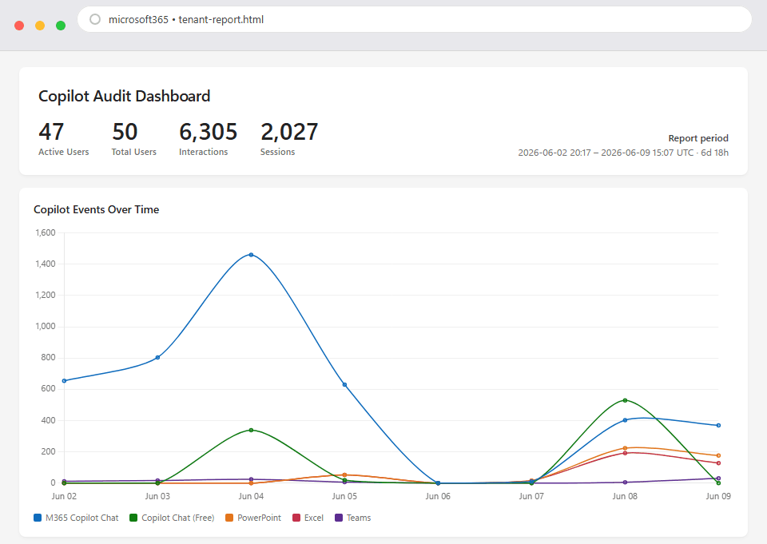

# Copilot Interaction Report (PowerShell) 📊



## Summary

This is a **PowerShell** sample that gathers Microsoft 365 Copilot **enterprise
interaction history** straight from the Microsoft Graph API and renders a
single, self-contained **HTML dashboard** — no Power BI, no database, no extra
infrastructure. Just run the script and open the resulting `.html` file in a
browser.

Unlike the Power BI samples in this folder (which build on Viva Insights or
Purview Audit exports), this sample reads the
[`getAllEnterpriseInteractions`](https://learn.microsoft.com/graph/api/aiinteractionhistory-getallenterpriseinteractions)
Graph endpoint directly, so it reflects the actual Copilot prompts and responses
recorded for each licensed user. The report shows:

1. Headline stats — active users, total licensed users, interactions, sessions
2. **Copilot events over time**, broken down by the top surfaces (a line chart)
3. **App / # Users / # Actions** — which Copilot surfaces are being used
4. **Top users** with a per-surface interaction breakdown
5. **Friction** — users with the highest AI-response error rates
6. **Usage by app feature** — prompt intent classified by keyword patterns
   (Summarize, Draft, Search, Analyze, …)
7. A sortable **All Users** leaderboard
8. **Audited events** — the most recent prompts with snippets

> The dataset shown in the recording above is fictional sample data.

## How it works

| Script | Role |
| :----- | :--- |
| `CopilotAnalytics.psm1` | Module with the reusable functions: `New-GraphContext`, `Export-CopilotInteractions`, `Build-CopilotReport`. |
| `New-CopilotInteractionReport.ps1` | Entry-point orchestrator. Authenticates, exports per-user JSON, then builds the HTML report. |

1. **Export** — `Export-CopilotInteractions` authenticates app-only to Graph,
   enumerates enabled users assigned the Copilot SKU, and pulls each user's
   interaction history into `<safe-upn>.json` (plus `_users.json` and
   `_summary.json`). Existing files act as a cache and are skipped.
2. **Report** — `Build-CopilotReport` aggregates those JSON files and writes a
   self-contained `copilot-report.html` (the only external dependency is the
   Chart.js CDN script used for the trend chart).

## Prerequisites

* **PowerShell 7+** (`pwsh`).
* An **Entra ID app registration** with the following Microsoft Graph
  **application** permissions, with **admin consent granted**:
  * `AiEnterpriseInteraction.Read.All`
  * `User.Read.All`
  * `Organization.Read.All`
* A **client secret** *or* a **certificate** for that app registration.
* Users licensed for **Microsoft 365 Copilot** (SKU
  `639dec6b-bb19-468b-871c-c5c441c4b0cb` by default — find others via
  `GET /v1.0/subscribedSkus`).

### Creating the app registration

1. In the [Entra admin center](https://entra.microsoft.com), go to
   **App registrations → New registration**. Give it a name and register it.
2. Under **API permissions → Add a permission → Microsoft Graph →
   Application permissions**, add the three permissions listed above, then click
   **Grant admin consent**.
3. Under **Certificates & secrets**, create either a **client secret** or upload
   a **certificate**.
4. Copy the **Directory (tenant) ID** and **Application (client) ID** from the
   app's **Overview** page.

## Instructions

From this folder, in a PowerShell 7 session:

```powershell
# Client-secret auth, last 30 days, all licensed users
.\New-CopilotInteractionReport.ps1 `
    -TenantId    <tenant-id> `
    -ClientId    <client-id> `
    -ClientSecret <secret-value> `
    -SinceDays 30
```

```powershell
# Certificate auth from the Windows certificate store
.\New-CopilotInteractionReport.ps1 `
    -TenantId   <tenant-id> `
    -ClientId   <client-id> `
    -CertificateThumbprint <thumbprint> `
    -SinceDays 30
```

```powershell
# Certificate auth from a .pfx file
$pw = Read-Host -AsSecureString "PFX password"
.\New-CopilotInteractionReport.ps1 `
    -TenantId <tenant-id> -ClientId <client-id> `
    -CertificatePath .\app.pfx -CertificatePassword $pw
```

You can also supply credentials via the `AZURE_TENANT_ID`, `AZURE_CLIENT_ID`,
and `AZURE_CLIENT_SECRET` environment variables instead of parameters.

When it finishes, the report (`copilot-report.html`) opens automatically in your
default browser. Pass `-NoLaunch` to suppress this.

### Useful parameters

| Parameter | Description | Default |
| :-------- | :---------- | :------ |
| `-SinceDays` | Only include interactions newer than N days (`0` = no filter). | `7` |
| `-SkuId` | License SKU to enumerate. | M365 Copilot |
| `-MaxUsers` | Cap the number of users (handy for a quick test). | `0` (all) |
| `-DataDir` | Folder for the per-user JSON export. | `.\data\interactions` |
| `-OutputPath` | Path of the HTML report to write. | `.\copilot-report.html` |
| `-SkipExport` | Skip the Graph export and rebuild the report from existing JSON. | off |
| `-NoLaunch` | Don't open the report in the browser when finished. | off (opens) |

### Rebuild the report without re-querying Graph

```powershell
.\New-CopilotInteractionReport.ps1 -SkipExport -DataDir .\data\interactions
```

## Notes

* **Copilot Studio agents** (declarative / custom agents invoked from Copilot
  Chat) do **not** register with the Graph interaction-history API this report is
  built on, so their usage is not reflected in the counts.
* Interaction history can contain prompt and response **content**. Treat the
  exported JSON and the generated report as sensitive, and handle them in line
  with your organization's data-privacy and governance policies.

## Author

| Author | Original Publish Date |
| :----- | :-------------------- |
| Dean Cron, Microsoft | June 2026 |

## Issues

Please report any issues you find to the [issues list](../../../../issues).

## Support Statement

The scripts, samples, and tools made available through the FastTrack Open Source
initiative are provided as-is. These resources are developed in partnership with
the community and do not represent official Microsoft software. As such, support
is not available through premier or other Microsoft support channels. If you find
an issue or have questions please reach out through the issues list and we'll do
our best to assist, however there is no associated SLA.

## Code of Conduct

This project has adopted the [Microsoft Open Source Code of Conduct](https://opensource.microsoft.com/codeofconduct/).
For more information see the [Code of Conduct FAQ](https://opensource.microsoft.com/codeofconduct/faq/) or
contact [opencode@microsoft.com](mailto:opencode@microsoft.com) with any additional questions or comments.

## Legal Notices

Microsoft and any contributors grant you a license to the Microsoft documentation and other content in this repository under the [MIT License](https://opensource.org/licenses/MIT), see the [LICENSE](LICENSE) file, and grant you a license to any code in the repository under the [MIT License](https://opensource.org/licenses/MIT), see the [LICENSE-CODE](LICENSE-CODE) file.

Microsoft, Windows, Microsoft Azure and/or other Microsoft products and services referenced in the documentation may be either trademarks or registered trademarks of Microsoft in the United States and/or other countries. The licenses for this project do not grant you rights to use any Microsoft names, logos, or trademarks. Microsoft's general trademark guidelines can be found at http://go.microsoft.com/fwlink/?LinkID=254653.

Privacy information can be found at https://privacy.microsoft.com/en-us/

Microsoft and any contributors reserve all others rights, whether under their respective copyrights, patents,or trademarks, whether by implication, estoppel or otherwise.
