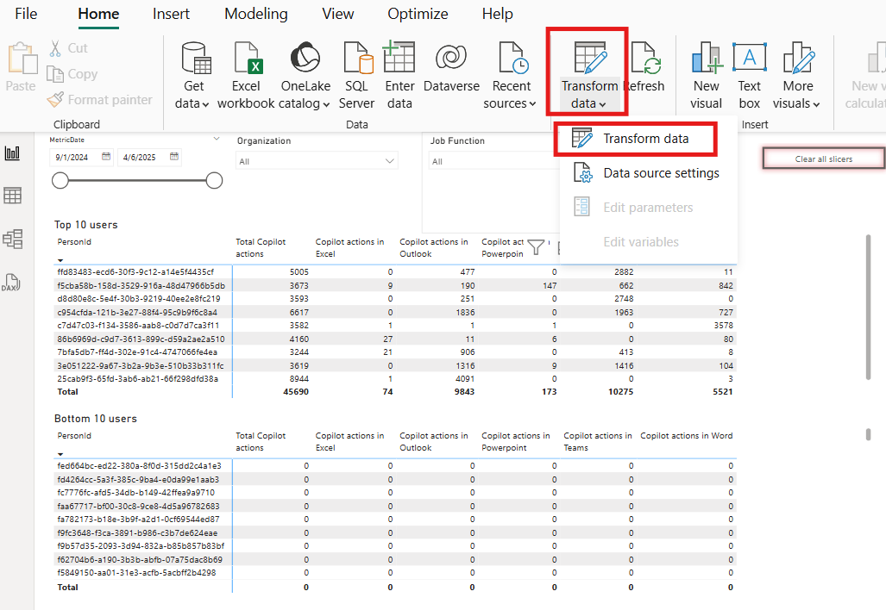
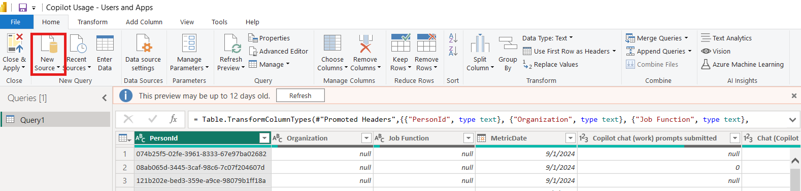
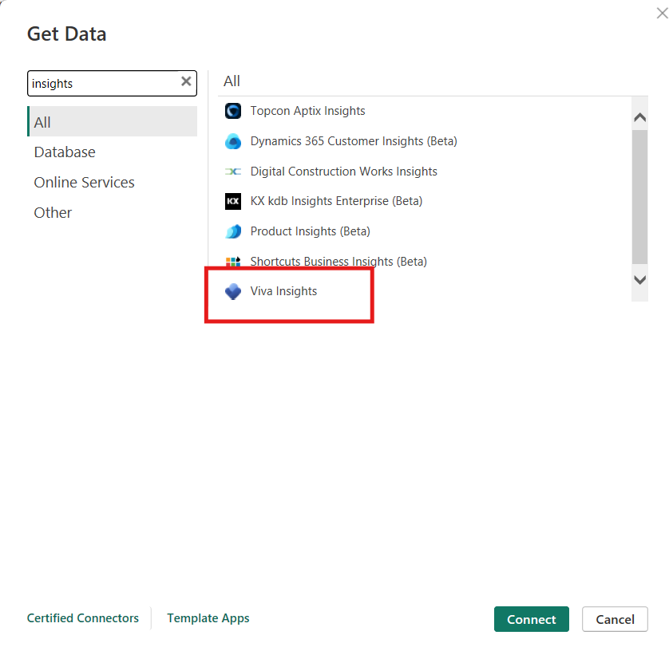

# Copilot Usage Dashboard - Users and Apps

## Summary

This is a PowerBI template file (.pbix) dispalying a sample of how a Viva Insights Person Query export can be used to visualize user and application data in PowerBI. This report allows you to display the following:

1. Leaderboard showcasing top/bottom users and filter these users by attribute (example, organization)
2. Number of Copilot actions taken, week over week
3. Number of active Copilot users, daily
4. Usage breakdown per app, by feature (understanding how each M365 app is using Copilot)

## Prerequisites

#### Required metrics
> Recommend capturing all M365 metrics available for customization
> 
> Required attributes - this report is built using Organization, PersonID, and Job Function. Add any additional attributes you include can be used as slicers

## Instructions

Replace with your data
1. Transform data
  
2. Delete "Query1"
3. Add "New Source" (the preferred source being Viva Insights)
  
  
4. If using Viva Insights, use PartitionID/QueryID and "row level security". Sign in as a "organization account". Data Connectivity mode of "Import"
5. Make sure your new source is named "Query1", rename if needed
6. Any filters that are showing errors, replace the "field" with an attribute from your "Query1"

## Author

|Author|Original Publish Date
|----|--------------------------
|Jacob Sgro, Microsoft|June 11th, 2025|

## Issues

Please report any issues you find to the [issues list](../../../../issues).

## Support Statement

The scripts, samples, and tools made available through the FastTrack Open Source initiative are provided as-is. These resources are developed in partnership with the community and do not represent official Microsoft software. As such, support is not available through premier or other Microsoft support channels. If you find an issue or have questions please reach out through the issues list and we'll do our best to assist, however there is no associated SLA.

## Code of Conduct

This project has adopted the [Microsoft Open Source Code of Conduct](https://opensource.microsoft.com/codeofconduct/).
For more information see the [Code of Conduct FAQ](https://opensource.microsoft.com/codeofconduct/faq/) or
contact [opencode@microsoft.com](mailto:opencode@microsoft.com) with any additional questions or comments.

## Legal Notices

Microsoft and any contributors grant you a license to the Microsoft documentation and other content in this repository under the [MIT License](https://opensource.org/licenses/MIT), see the [LICENSE](LICENSE) file, and grant you a license to any code in the repository under the [MIT License](https://opensource.org/licenses/MIT), see the [LICENSE-CODE](LICENSE-CODE) file.

Microsoft, Windows, Microsoft Azure and/or other Microsoft products and services referenced in the documentation may be either trademarks or registered trademarks of Microsoft in the United States and/or other countries. The licenses for this project do not grant you rights to use any Microsoft names, logos, or trademarks. Microsoft's general trademark guidelines can be found at http://go.microsoft.com/fwlink/?LinkID=254653.

Privacy information can be found at https://privacy.microsoft.com/en-us/

Microsoft and any contributors reserve all others rights, whether under their respective copyrights, patents,or trademarks, whether by implication, estoppel or otherwise.
