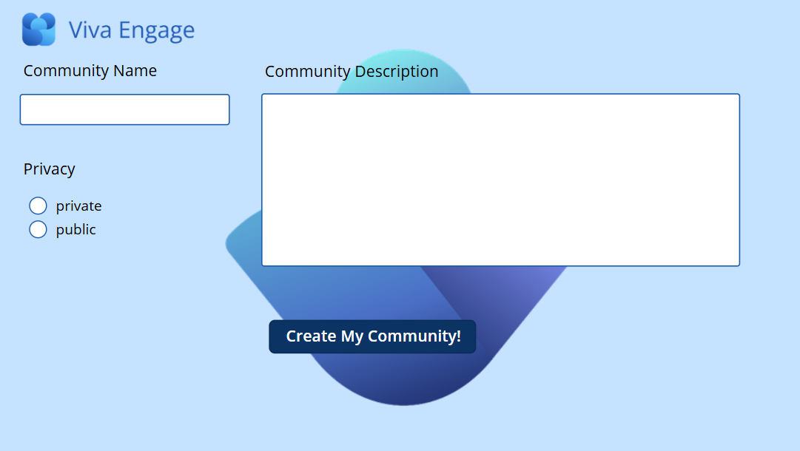

# Viva Engage Community Creation Power App - Sample

## Summary

This Power App import package is intended to be used as a sample that shows how to use the [Viva Engage Community Creation API]([https://learn.microsoft.com/en-us/graph/api/employeeexperience-post-communities?view=graph-rest-beta&tabs=http](https://learn.microsoft.com/en-us/graph/api/employeeexperience-post-communities?view=graph-rest-1.0&tabs=http)) to create new communities. Please review the included [Word document](AppImportInstructions.docx) for steps on how to import it into your environment.

## Prerequisites

> Microsoft Viva Engage

## Solution

| Solution    | Author(s)                                               |
| ----------- | ------------------------------------------------------- |
| Viva Engage Community Creation Power App - Sample | Dean Cron - dean.cron@microsoft.com |

## Version history

| Version | Date             | Comments        |
| ------- | ---------------- | --------------- |
| 1.0.0     | July 31st, 2024 | Initial release |

## Disclaimer

**THIS CODE IS PROVIDED _AS IS_ WITHOUT WARRANTY OF ANY KIND, EITHER EXPRESS OR IMPLIED, INCLUDING ANY IMPLIED WARRANTIES OF FITNESS FOR A PARTICULAR PURPOSE, MERCHANTABILITY, OR NON-INFRINGEMENT.**

---

