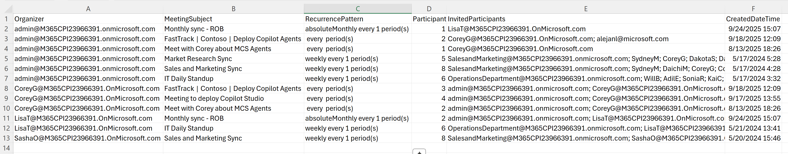

Of course. Here is the final `readme.md` with the requested publisher section included.

# 📜 Microsoft Teams Recurring Meeting Report

This PowerShell script scans all user calendars in a Microsoft 365 tenant to find and report on all recurring Teams meetings. It exports key details to a CSV file, including the organizer, meeting subject, participant count, and a list of invited participants.

The script uses the Microsoft Graph API with **Application permissions**, ensuring it can run securely as an authorized background process.




-----

## 📋 Prerequisites

Before you begin, make sure you have the following:

  * ✅ **PowerShell 7+** is recommended.
  * ✅ The **Microsoft.Graph** PowerShell module.
  * ✅ An administrator role (such as **Global Administrator**) to perform the one-time setup.

If you don't have the module installed, open PowerShell as an administrator and run:

```powershell
Install-Module Microsoft.Graph -Scope AllUsers -Force
```

-----

## ⚙️ One-Time Setup: Create an App Registration

The script authenticates using an App Registration in Microsoft Entra ID. This is a one-time setup that allows the script to run with its own permissions, granted by an administrator.

### 1️⃣ Create the App Registration

1.  Navigate to the **[Microsoft Entra admin center](https://entra.microsoft.com)**.
2.  Go to **Identity** \> **Applications** \> **App registrations**.
3.  Click **+ New registration**.
4.  Give it a descriptive name (e.g., `Teams Meeting Report Script`).
5.  Leave the other settings as default and click **Register**.

### 2️⃣ Grant API Permissions

1.  In your new App Registration, go to the **API permissions** blade.
2.  Click **+ Add a permission**, then select **Microsoft Graph**.
3.  Select **Application permissions**.
4.  Search for and check the boxes next to the following two permissions:
      * `Calendars.Read`
      * `User.Read.All`
5.  Click **Add permissions**.
6.  ⚠️ **Important:** Click the **Grant admin consent for [Your Tenant]** button to approve the permissions. The status for both should change to a green checkmark.

### 3️⃣ Create a Client Secret

1.  Go to the **Certificates & secrets** blade.
2.  Click **+ New client secret**.
3.  Add a description and choose an expiration period.
4.  Click **Add**.
5.  ⚠️ **Immediately copy the secret's "Value"** and save it somewhere secure (like a password manager). You will not be able to see it again after you leave this page.

-----

## ▶️ Running the Script

1.  Save the script to your computer with a `.ps1` extension (e.g., `Get-RecurringTeamsMeetings.ps1`).
2.  Open a PowerShell terminal and navigate to the directory where you saved the script.
3.  Run the script:
    ```powershell
    .\Get-RecurringTeamsMeetings.ps1
    ```
4.  You will be prompted to enter the following information:
      * **Directory (Tenant) ID**: Found on the **Overview** page of your App Registration.
      * **Application (Client) ID**: Also found on the **Overview** page of your App Registration.
      * **Client Secret**: The secret value you copied. Your input will be hidden for security.

-----

## 📄 Output

The script generates a CSV file named `RecurringMeetingsReport.csv` in the same directory where the script is located. The report contains the following columns:

  * **Organizer**: The user principal name of the meeting's creator.
  * **MeetingSubject**: The subject or title of the meeting.
  * **RecurrencePattern**: A description of how often the meeting occurs.
  * **ParticipantCount**: The total number of invitees.
  * **InvitedParticipants**: A semicolon-separated list of invitee email addresses.
  * **CreatedDateTime**: The timestamp when the recurring meeting series was first created.


-----

## ✍️ Publisher

  * **Author:** Alejandro Lopez | [alejandro.lopez@microsoft.com](mailto:alejandro.lopez@microsoft.com)
  * **Published:** September 24, 2025

-----

## ⚠️ Disclaimer

This script is provided as-is, without warranty. It is not officially supported by Microsoft. Please test it in a development or test environment before running it in a production environment.