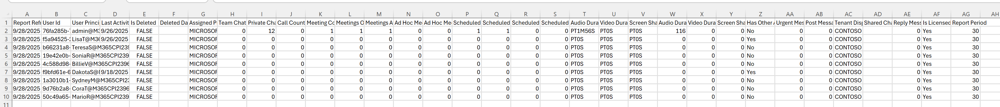

# 📊 Microsoft Teams User Activity Report

This PowerShell script retrieves detailed Teams user activity data from Microsoft 365 using the Microsoft Graph API. It can generate reports for **all users** in the tenant or a **targeted list of users** from a CSV file. The report includes metrics such as meetings organized, meeting duration, chat activity, calls, and more—providing the same data as the `Get-MgReportTeamUserActivityUserDetail` cmdlet, but with more flexibility. 

The script uses the Microsoft Graph API directly with **Application permissions**, ensuring it can run securely as an authorized background process.



-----

## 📋 Prerequisites

Before you begin, make sure you have the following:

  * ✅ **PowerShell 5.1+** (PowerShell 7+ recommended)
  * ✅ An administrator role (such as **Global Administrator** or **Reports Reader**) to perform the one-time setup

> **Note:** This script does **not** require the Microsoft.Graph PowerShell module. It communicates directly with the Graph API using native PowerShell commands.

-----

## ⚙️ One-Time Setup: Create an App Registration

The script authenticates using an App Registration in Microsoft Entra ID. This is a one-time setup that allows the script to run with its own permissions, granted by an administrator.

### 1️⃣ Create the App Registration

1.  Navigate to the **[Microsoft Entra admin center](https://entra.microsoft.com)**.
2.  Go to **Identity** \> **Applications** \> **App registrations**.
3.  Click **+ New registration**.
4.  Give it a descriptive name (e.g., `Teams Activity Report Script`).
5.  Leave the other settings as default and click **Register**.

### 2️⃣ Grant API Permissions

1.  In your new App Registration, go to the **API permissions** blade.
2.  Click **+ Add a permission**, then select **Microsoft Graph**.
3.  Select **Application permissions**.
4.  Search for and check the box next to:
      * `Reports.Read.All`
5.  Click **Add permissions**.
6.  ⚠️ **Important:** Click the **Grant admin consent for [Your Tenant]** button to approve the permission. The status should change to a green checkmark.

### 3️⃣ Create a Client Secret

1.  Go to the **Certificates & secrets** blade.
2.  Click **+ New client secret**.
3.  Add a description and choose an expiration period.
4.  Click **Add**.
5.  ⚠️ **Immediately copy the secret's "Value"** and save it somewhere secure (like a password manager). You will not be able to see it again after you leave this page.

### 4️⃣ Gather Required Information

You will need three pieces of information to run the script:

  * **Directory (Tenant) ID**: Found on the App Registration's **Overview** page
  * **Application (Client) ID**: Also found on the **Overview** page
  * **Client Secret Value**: The value you copied in step 3

-----

## ▶️ Running the Script

1.  Save the script to your computer with a `.ps1` extension (e.g., `Get-TeamsUserActivityReport.ps1`).
2.  Open a PowerShell terminal and navigate to the directory where you saved the script.
3.  Choose one of the following methods to run the script. You will be prompted for your Tenant ID, App ID, and Client Secret.

### Method 1: Generate Report for ALL Users

To run the script against every user in your tenant, execute it with only the period parameter:

```powershell
.\Get-TeamsUserActivityReport.ps1 -Period "D7"
```

**Available Period Options:**
  * `D7` - Last 7 days (default)
  * `D30` - Last 30 days
  * `D90` - Last 90 days
  * `D180` - Last 180 days

### Method 2: Generate Report for Specific Users from a CSV File

To target only specific users, use the `-UserCsvPath` parameter.

**1. Create your CSV file:** The file must contain a header row with the column name `UserPrincipalName`.
Example `users.csv` file:

```csv
UserPrincipalName
adele.vance@yourtenant.onmicrosoft.com
alex.wilber@yourtenant.onmicrosoft.com
diego.siciliani@yourtenant.onmicrosoft.com
```

**2. Run the script with both parameters:**

```powershell
.\Get-TeamsUserActivityReport.ps1 -UserCsvPath "C:\path\to\your\users.csv" -Period "D30"
```

-----

## 📄 Output

The script generates a CSV file in the same directory where the script is located. The filename will be:
  * `TeamsUserActivityReport_AllUsers_[Period].csv` - When run against all users
  * `TeamsUserActivityReport_Filtered_[Period].csv` - When run with a CSV file

### Report Columns

The report contains comprehensive Teams activity metrics, including:

  * **Report Refresh Date**: When the data was last refreshed
  * **User Principal Name**: The user's email address
  * **Display Name**: The user's display name
  * **Last Activity Date**: The date of the user's most recent Teams activity
  * **Team Chat Message Count**: Number of messages sent in team channels
  * **Private Chat Message Count**: Number of private chat messages sent
  * **Call Count**: Total number of calls participated in
  * **Meeting Count**: Total number of meetings attended
  * **Meetings Organized Count**: Number of meetings the user organized
  * **Has Other Action**: Whether the user performed other Teams activities
  * **Ad Hoc Meetings Organized Count**: Number of ad-hoc meetings organized
  * **Ad Hoc Meetings Attended Count**: Number of ad-hoc meetings attended
  * **Scheduled One-time Meetings Organized Count**: One-time scheduled meetings organized
  * **Scheduled One-time Meetings Attended Count**: One-time scheduled meetings attended
  * **Scheduled Recurring Meetings Organized Count**: Recurring meetings organized
  * **Scheduled Recurring Meetings Attended Count**: Recurring meetings attended
  * **Audio Duration**: Total audio call duration in seconds
  * **Video Duration**: Total video call duration in seconds
  * **Screen Share Duration**: Total screen sharing duration in seconds
  * **Urgent Messages**: Number of urgent messages sent
  * **Post Messages**: Number of post messages
  * **Reply Messages**: Number of reply messages
  * **Report Period**: The reporting period (e.g., 7 days, 30 days)

And many more columns providing detailed insights into user activity.

-----

## 🔍 Troubleshooting

### "No matching users found in the report"
  * Verify that the users in your CSV have had Teams activity during the selected period
  * Check that the User Principal Names in your CSV match exactly (case doesn't matter)
  * Ensure there are no leading/trailing spaces in your CSV

### "Access Denied (403)"
  * Verify that `Reports.Read.All` permission is added to the App Registration
  * Ensure admin consent has been granted (green checkmark in API permissions)
  * Wait 5-10 minutes after granting permissions before running the script

### "Unauthorized (401)"
  * Verify your Tenant ID, Application ID, and Client Secret are correct
  * Check if the client secret has expired and create a new one if needed


-----

## ✍️ Publisher

  * **Publisher:** Alejandro Lopez | [alejandro.lopez@microsoft.com](mailto:alejandro.lopez@microsoft.com)
  * **Published:** September 30, 2025

-----

## ⚠️ Disclaimer

This script is provided as-is, without warranty. It is not officially supported by Microsoft. Please test it in a development or test environment before running it in a production environment.
